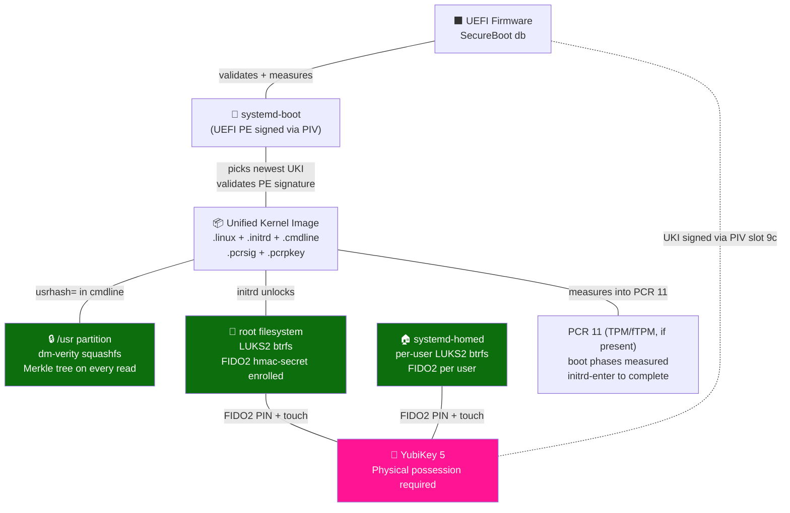
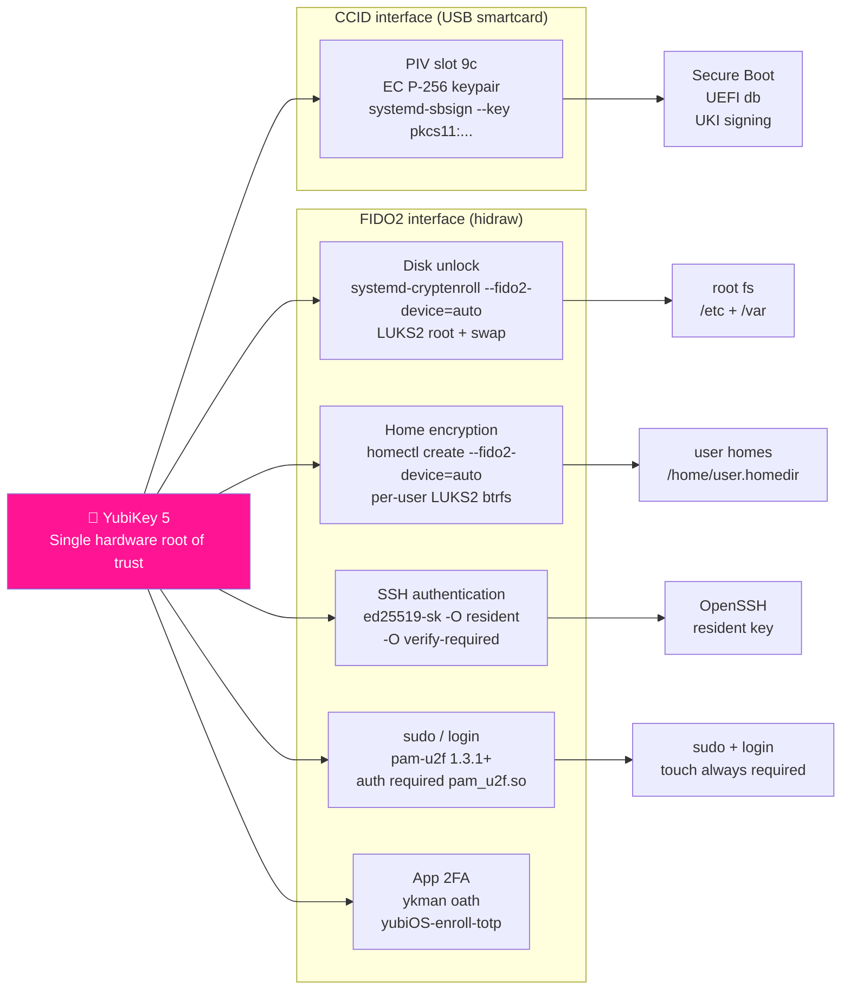
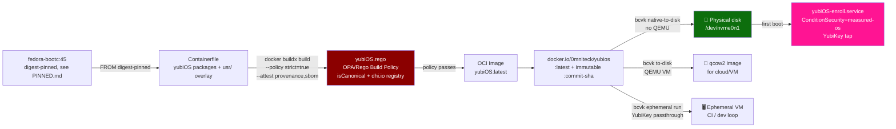
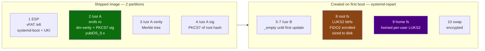
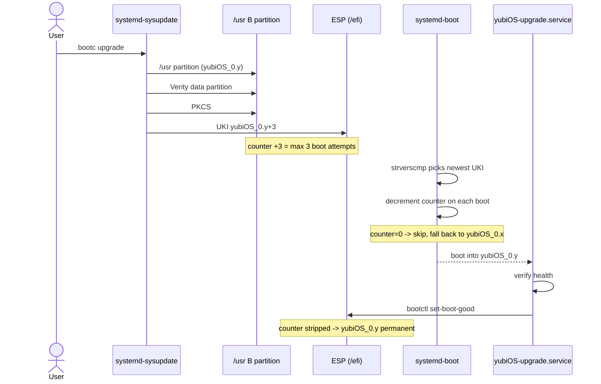
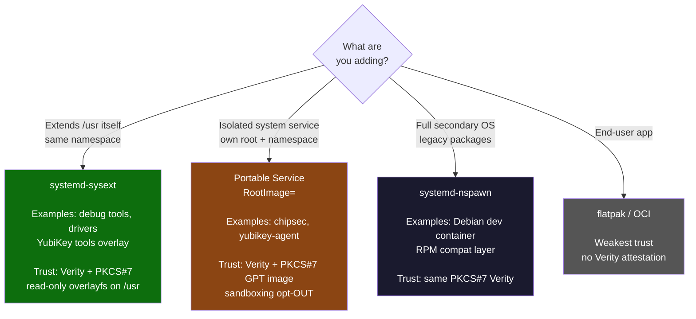
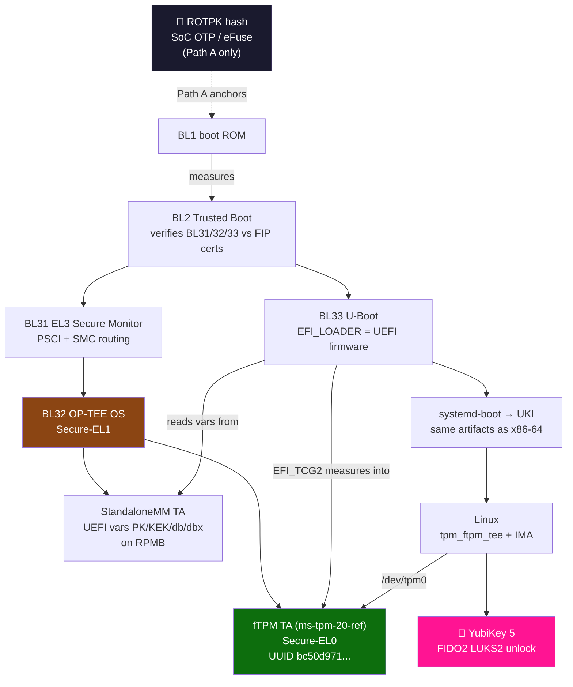
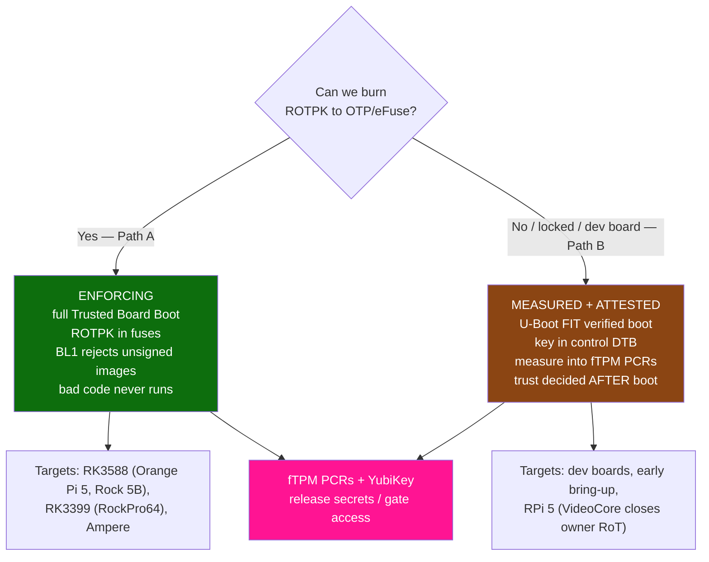

# yubiOS — Architecture

> *No TPM. No OEM. No trust anchors you don't control.*

YubiKey replaces the TPM at every trust boundary: Secure Boot signing, disk encryption,
home directory encryption, SSH, and PAM authentication. ARM64 is yubiOS's primary target
platform (ADR-023) — it is the only platform where yubiOS owns the hardware root of trust
all the way to the boot ROM key (§7, ADR-018/019/020/021). x86-64 is a fully supported
secondary platform with an identical trust chain above the UKI.

---

## 1. Boot Trust Chain

Every component from firmware to userspace is cryptographically signed and measured.
The YubiKey is the sole un-exportable root of trust.

---

## 2. YubiKey Interface Map

One hardware token. Five trust boundaries.

---

## 3. Build Pipeline

Single OCI image. Three deployment paths.

---

## 4. Disk Partition Layout

---

## 5. A/B Update Lifecycle

---

## 6. Modularity Ladder

---

## 7. ARM64 Secure-World Stack (Primary Platform; Hardware Bring-Up Post-Launch — ADR-018/019/020/021/023)

> ARM64 is yubiOS's primary target platform (ADR-023). This section is the owner-owned root of
> trust yubiOS builds itself: TF-A, OP-TEE, the fTPM, and U-Boot. Hardware bring-up on real boards
> is post-launch; the YubiKey stays the primary RoT, the fTPM is the platform-integrity root. Full plan: [FUTURE.md](FUTURE.md).

### 7a. ARM64 boot trust chain (TF-A → OP-TEE/fTPM → U-Boot UEFI)

### 7b. Two provisioning paths (root of trust)

---

## Key Version Requirements

| Component | Minimum | Reason |
|---|---|---|
| systemd | **261** | `ConditionSecurity=measured-os`, `systemd-sbsign`, FIDO2 cryptenroll |
| YubiKey firmware | **5.2.3** | ed25519-sk support |
| OpenSSH | **8.2** | FIDO2 key types |
| pam-u2f | **1.3.1** | CVE-2025-23013 fix |
| Fedora | **45** post-June-19 | systemd 261, fedora-bootc purpose-built base |

---

*All architectural decisions with rationale and sources in [ADR.md](ADR.md).*
