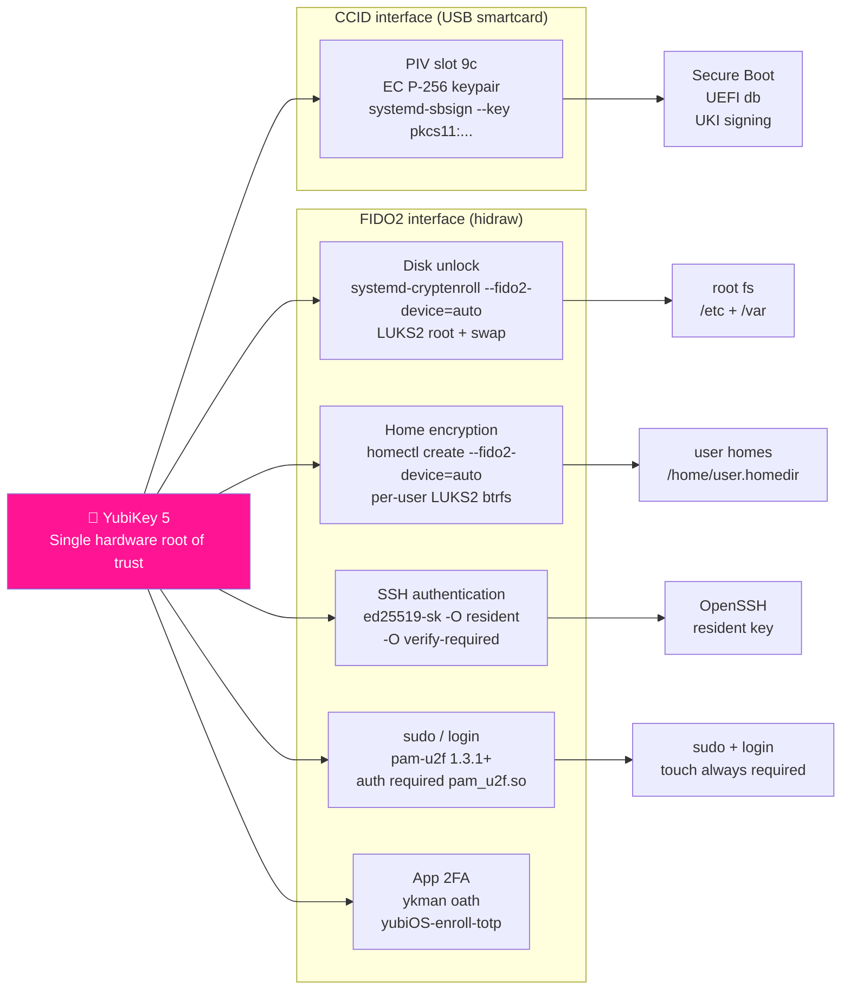
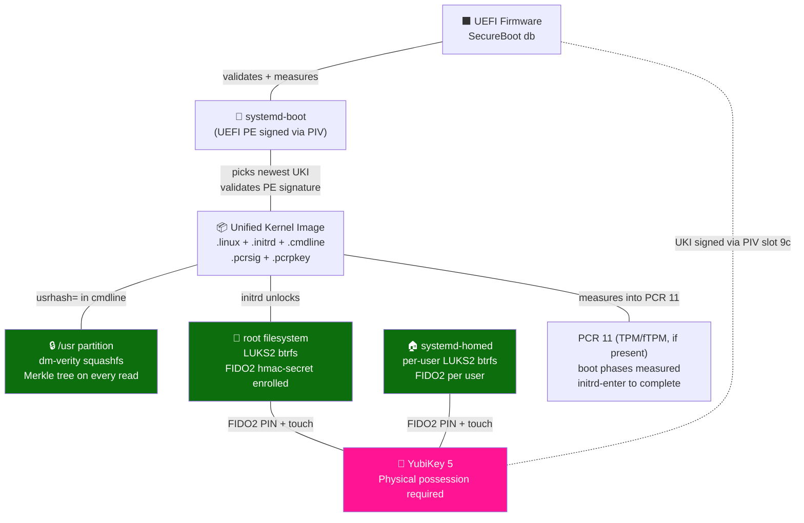
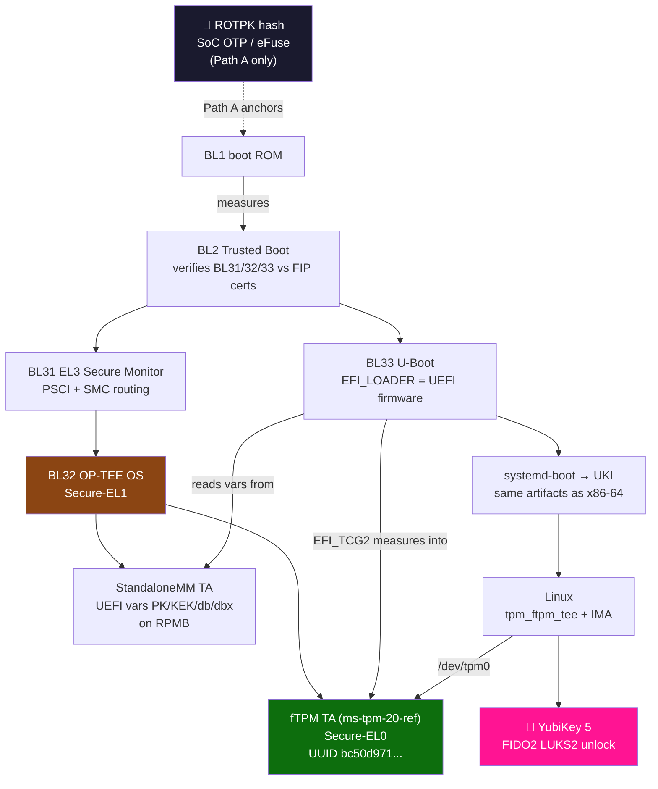
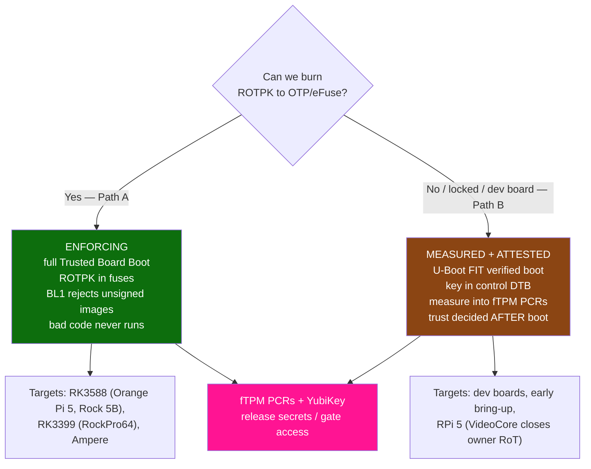
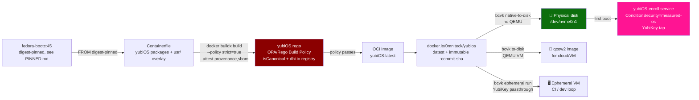
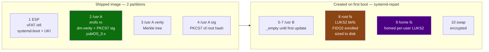
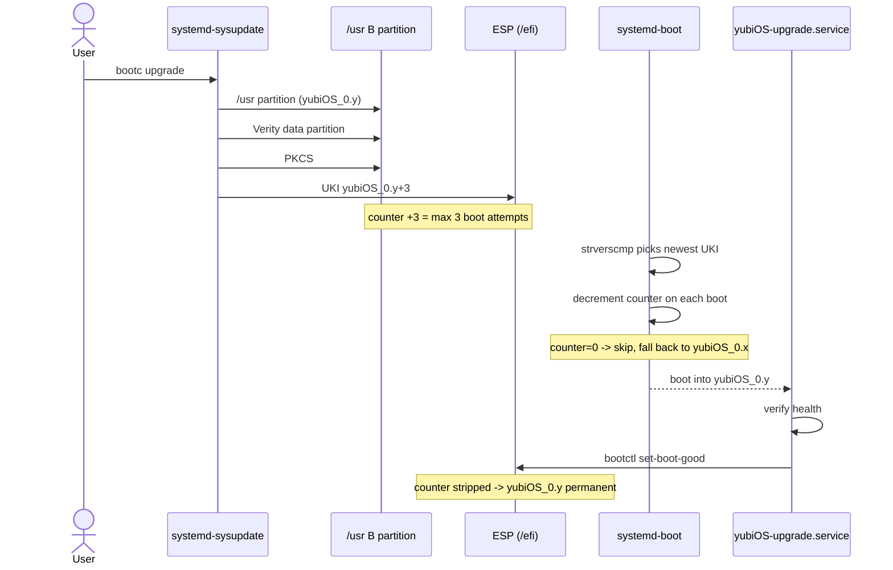
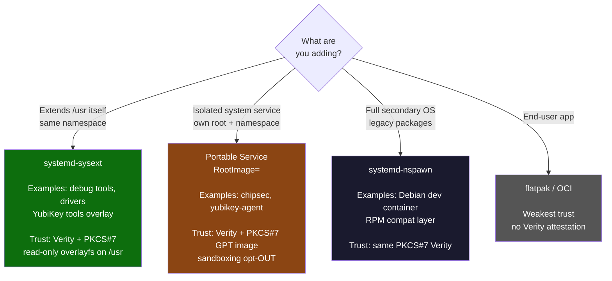

# yubiOS Architecture

Last reviewed: 2026-07-11
Status: planning baseline for `main`; ARM64 is primary, x86-64 is secondary and supported.

This document describes the current yubiOS architecture at the level needed for planning, review, and CI triage. Normative requirements live in [SPEC.md](SPEC.md), decisions live in [ADR.md](ADR.md), pinned inputs live in [PINNED.md](PINNED.md), and threat coverage lives in [MITIGATE.md](MITIGATE.md).

## Thesis

yubiOS is a FIDO2-first immutable Linux system where the owner-held YubiKey is the human-presence and identity root of trust. The platform root is intentionally separate: on ARM64, the long-term production path is an owner-provisioned TF-A + OP-TEE + fTPM stack; on x86-64, the platform firmware and TPM remain OEM-supplied, so x86-64 is fully supported but not the flagship ownership story.

## Target Platforms

| Platform | Priority | Trust-chain stance | Current use |
|---|---:|---|---|
| ARM64 / RK3588 Path A | Primary | Owner-burned ROTPK, TF-A Trusted Board Boot, OP-TEE, fTPM, U-Boot UEFI, signed UKI | Flagship target and post-launch hardware bring-up |
| ARM64 / Path B boards | Primary development | FIT verification plus measured/attested boot where fuses are unavailable or unsafe | CI and board bring-up rehearsal |
| x86-64 | Secondary, supported | Owner-enrolled UEFI Secure Boot above OEM firmware; optional TPM/fTPM for measurement only | VM CI, developer installs, compatibility |

## Trust Boundaries

| Boundary | Mechanism | Owner-controlled material | Notes |
|---|---|---|---|
| Secure Boot / UKI signing | `systemd-sbsign` via YubiKey PIV slot 9c | PIV private key and enrolled certificate | Requires CCID/pcscd; not a FIDO2/hidraw operation |
| Disk unlock | LUKS2 + `systemd-cryptenroll --fido2-device=auto --fido2-with-client-pin=yes` | FIDO2 hmac-secret credential plus recovery key | No TPM slot is enrolled as the sole unlock gate |
| User homes | `systemd-homed` LUKS2 + FIDO2 | Per-user FIDO2 credential | Enables per-user cryptographic lock and portable homes |
| SSH | OpenSSH `ed25519-sk` resident keys | FIDO2 resident key | PIN verification is expected for administrative use |
| Login / sudo | pam-u2f >= 1.3.1 | FIDO2/U2F credential | `required`, not `sufficient`, so touch remains mandatory |
| Platform measurement | TPM/fTPM PCRs and `ConditionSecurity=measured-os` | ARM64 fTPM owned by yubiOS on Path A | Measurement is complementary to YubiKey possession, not a replacement |

## Boot Flow

### ARM64 Primary Path

1. Boot ROM verifies an owner-burned ROTPK hash when the board supports Path A.
2. TF-A BL1/BL2 verify BL31, OP-TEE BL32, and U-Boot BL33.
3. OP-TEE hosts StandaloneMM and the fTPM trusted application; RPMB backs secure variables and TPM NV state on production boards.
4. U-Boot provides UEFI services, Secure Boot variable handling, and measured boot into the fTPM.
5. systemd-boot loads the same signed UKI used on x86-64.
6. `/usr` is immutable and verified through composefs, erofs, and dm-verity.
7. Root, swap, and user homes unlock through YubiKey FIDO2 plus recovery material.

### x86-64 Supported Path

1. Owner-enrolled UEFI Secure Boot verifies systemd-boot and the signed UKI.
2. TPM measurement is used where available, but the TPM is not the owner-held identity root.
3. `/usr`, root, swap, and home follow the same immutable and FIDO2-gated runtime model as ARM64.

## Build And Distribution

The project keeps both build paths active:

| Path | Output | Purpose |
|---|---|---|
| bootc / OCI | `docker.io/0mniteck/yubios:latest`, `<sha>`, and test tags | Day-2 update stream and VM test source |
| mkosi | signed UKI and disk image | Installer and image-level validation |
| firmware OCI tags | `firmware`, `firmware-<sha>` | ARM64 secure-world bundle publication |
| dev OCI tags | `dev`, `dev-<sha>` | TEST-only swu2f-enabled boot validation image |

`PINNED.md` is the single source of truth for base-image digests and tool pins. Run-specific digests in old workflow logs or historical ADRs are evidence, not evergreen requirements.

## Version Requirements

| Component | Minimum / stance | Why |
|---|---|---|
| systemd | v261 target in current base | `ConditionSecurity=measured-os`, `systemd-tpm2-swtpm.service`, `systemd-sysinstall`, LUO/KHO research, and v261 planning work |
| systemd-sbsign | v257+ | Native PKCS#11 UKI signing path |
| pam-u2f | 1.3.1+ | Avoids CVE-2025-23013 bypass class |
| OpenSSL | 3.5+ for OpenSSL clients | Default hybrid `X25519MLKEM768` group |
| Go | 1.24+ for Go TLS clients | Default hybrid `X25519MLKEM768` group in `crypto/tls` |
| QEMU | Pinned by workflow | zstd EFI zboot boot compatibility is handled through the current pinned workaround |

### systemd hardening correction

The 2026-07-11 research cycle found one important wording bug: `RestrictFileSystems=` is not a new v261 directive. It is the older BPF-LSM filesystem-type limiter documented in `systemd.exec(5)`. systemd v261 added `RestrictFileSystemAccess=`, which should be evaluated separately. Documentation and future hardening audits should avoid gating `RestrictFileSystems=` on v261.

## First-Boot Services

| Service | Gate | Notes |
|---|---|---|
| `yubiOS-chipsec-firstboot.service` | `ConditionSecurity=measured-os`, `ConditionFirstBoot=yes` | One-shot firmware validation; raw hardware access is explicitly scoped |
| `yubiOS-enroll.service` | Measured boot expected | Enrolls owner YubiKey and recovery material after first boot |
| repart / install flow | DPS and systemd-repart | No traditional `/etc/fstab` installer model |

## Current Research Notes

The active planning note for this refresh is [refs/planning-cycle-2026-07-11.md](refs/planning-cycle-2026-07-11.md). It records the sources consulted, the inconsistencies found, and follow-up items for CI and hardware validation.

## Open Edges

- ARM64 Path A still needs real-board fuse/RPMB validation before being claimed as a production hardware route.
- The zstd EFI zboot workaround should remain pinned and explicit until upstream QEMU behavior is available in the runner fleet.
- PQ TLS is satisfied by current OpenSSL and Go defaults, but CI should keep asserting it so a future base digest does not silently regress.
- The U-Boot FIDO2/U2F console gate remains idea-stage until the USB HID and recovery model are audited.
