# CI_MAP.md

Generated from the `docs/research` branch workflow files after fast-forwarding it to `main` on 2026-07-16 UTC.

This map treats `.github/workflows/*.yml` as the source of truth and focuses on CI steps, file inputs, artifact outputs, registry outputs, and callback handoffs. `PINNED.md` remains the source of truth for approved action SHAs and image digests.

## Workflow Inventory

| Workflow file | Role | Main inputs | Main outputs |
|---|---|---|---|
| `.github/workflows/ci.yml` | Top-level state machine | workflow dispatch inputs, callback state | Dispatches the next workflow in the ordered chain |
| `.github/workflows/fetch-dhi-manifest.yml` | DHI base digest refresh | `dhi.io/debian-base:trixie-debian13-dev`, `PINNED.md` | Updated DHI digest refs committed by workflow when drift exists |
| `.github/workflows/fetch-fedora-bootc-manifest.yml` | Fedora bootc digest refresh | `quay.io/fedora/fedora-bootc:45`, `PINNED.md` | Updated Fedora bootc digest refs committed by workflow when drift exists |
| `.github/workflows/ci_test-int.yml` | ARM64 fTPM firmware integration | yubi-OS firmware forks, pinned refs, StMM/fTPM/U-Boot/TF-A sources | `BL32_AP_MM.fd`, `fip.bin`, `flash.bin`, QEMU verification, optional `0mniteck/yubios:firmware` |
| `.github/workflows/yubiOS-ci.yml` | Production image build and publish | `Containerfile`, `yubiOS.rego`, `usr/**`, `tests/unit/**`, `mkosi.*` | local CI images, optional per-arch and multi-arch `0mniteck/yubios:<sha>` and `latest` |
| `.github/workflows/ci_dev_image.yml` | Test image with software FIDO2 | `Containerfile`, `Containerfile.dev`, `yubiOS.rego` | optional `0mniteck/yubios:dev-<sha>` and `dev` |
| `.github/workflows/ci_test-vm.yml` | VM e2e tests | `tests/vm/*.sh`, pullable yubiOS image, bcvk `feat/swtpm-ci` | bcvk capability gate, VM boot/enrollment test results, callback state |
| `.github/workflows/ci_mkosi-installer.yml` | mkosi disk image and installer artifact | `mkosi.conf`, `mkosi.conf.d/**`, SoftHSM PKCS#11 mock | signed UKI verification, `yubiOS.raw.zst`, optional `0mniteck/yubios:installer` |
| `.github/workflows/ci_pq_tls_verify.yml` | PQ hybrid TLS drift check | DHI base container, live TLS endpoint, OpenSSL and Go floors | non-blocking PQ verification result |
| `.github/workflows/ci_fork_*.yml` | Optional fork component checks | yubi-OS fork feature branches | component build/lint/test artifacts and callback state |

The older `ci_int_stmm.yml`, `ci_int_optee_fip.yml`, and `ci_int_qemu.yml` lane names are not separate files on this branch. Their StMM, OP-TEE/FIP, and QEMU stages are embedded in `.github/workflows/ci_test-int.yml`.

## Top-Level State Machine

`ci.yml` is the coordinator. Each child workflow reports back by dispatching `ci.yml` with `state=<completed workflow name>` and `completed_conclusion=<success|failure|cancelled>`. The coordinator stops on non-success before dispatching the next workflow.

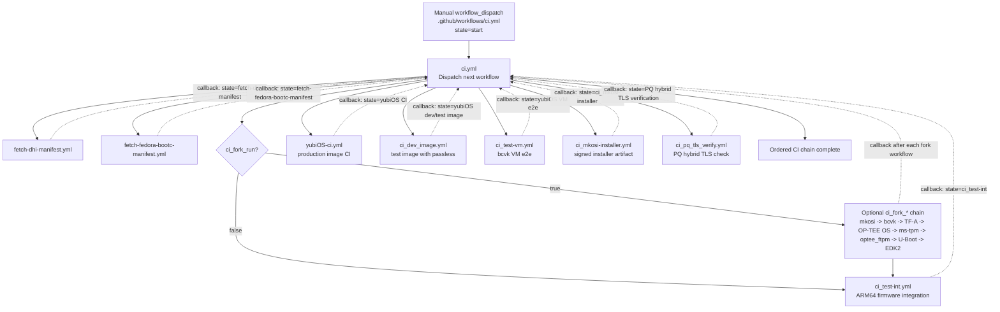

## Production Image CI

`yubiOS-ci.yml` runs text and build gates, then optionally publishes the production multi-arch bootc image.

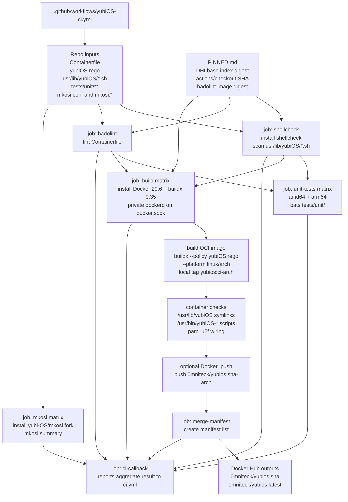

## Dev Image and VM E2E

The dev image is intentionally separate from production. It layers `Containerfile.dev` on the production image and verifies `passless`, then the VM workflow uses that pullable image for bcvk-backed tests.

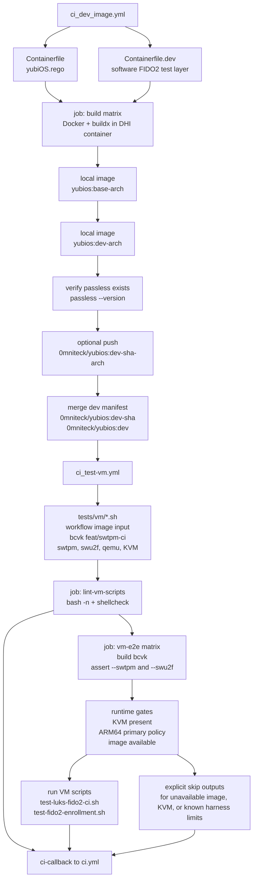

## ARM64 fTPM Firmware Integration

`ci_test-int.yml` embeds the former F1/F2/F4 lane stages in one workflow. It builds StMM, folds fTPM into OP-TEE, packages TF-A FIP with U-Boot BL33, boots QEMU, and optionally publishes a firmware OCI artifact.

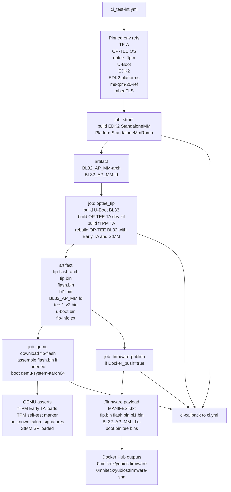

## Optional Fork Component CI

When `ci_fork_run=true`, `ci.yml` runs these component workflows before integration. They validate yubi-OS fork feature branches but do not stitch a full firmware image; stitching happens in `ci_test-int.yml`.

```mermaid
flowchart LR
    start["ci.yml after Fedora digest refresh"]
    mkosi["ci_fork_mkosi.yml\nrepo: yubi-OS/mkosi\nref: feature/yubiOS-profile\nprofile syntax, shellcheck, ruff"]
    bcvk["ci_fork_bcvk.yml\nrepo: yubi-OS/bcvk\nref: feat/ci\nRust unit tests, cargo check, advisory clippy"]
    tfa["ci_fork_arm-trusted-firmware.yml\nrepo: yubi-OS/arm-trusted-firmware\nref: feat/ci\nBL31 + placeholder TBB FIP"]
    optee["ci_fork_optee-os.yml\nrepo: yubi-OS/optee_os\nref: feat/ci\nBL32 + TA dev kit"]
    ms["ci_fork_ms-tpm-20-ref.yml\nrepo: yubi-OS/ms-tpm-20-ref\nref: feat/ci\ntpm2 simulator + libtpm"]
    ftpm["ci_fork_optee-ftpm.yml\nrepo: yubi-OS/optee_ftpm\nref: feat/ci\nfTPM TA vs OP-TEE dev kit"]
    uboot["ci_fork_u-boot.yml\nrepo: yubi-OS/u-boot\nref: feat/ci\nBL33 with fTPM and measured boot config"]
    edk2["ci_fork_edk2.yml\nrepo: yubi-OS/edk2\nref: feat/ci\nStandaloneMM AARCH64 build"]
    integ["ci_test-int.yml\nfull integration after optional fork chain"]

    start --> mkosi --> bcvk --> tfa --> optee --> ms --> ftpm --> uboot --> edk2 --> integ
```

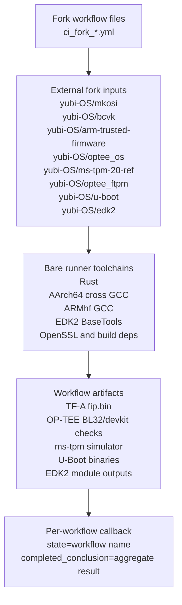

## Manifest Refreshers

The manifest refresh workflows are intentionally bare-runner jobs because they query registries and update text files. They can commit digest updates directly when a new index digest is found.

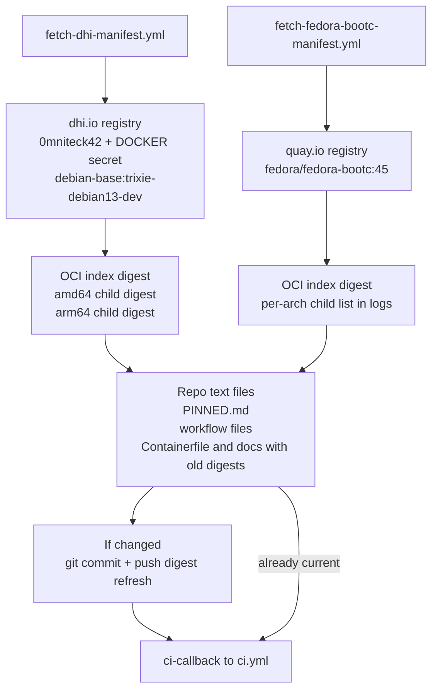

## Installer and PQ Verification

The installer workflow proves the mkosi plus PKCS#11 signing path using SoftHSM as a CI-safe stand-in for YubiKey PIV slot 9c. The PQ TLS workflow is a drift check for ADR-025 and currently runs non-blocking.

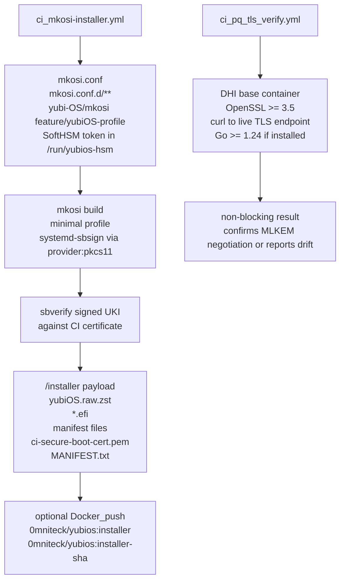

## Push Triggers and Self-Change Validation

Most workflows are `workflow_dispatch` driven. Narrow `push` triggers are used only where the workflow file itself or relevant source paths should validate automatically.

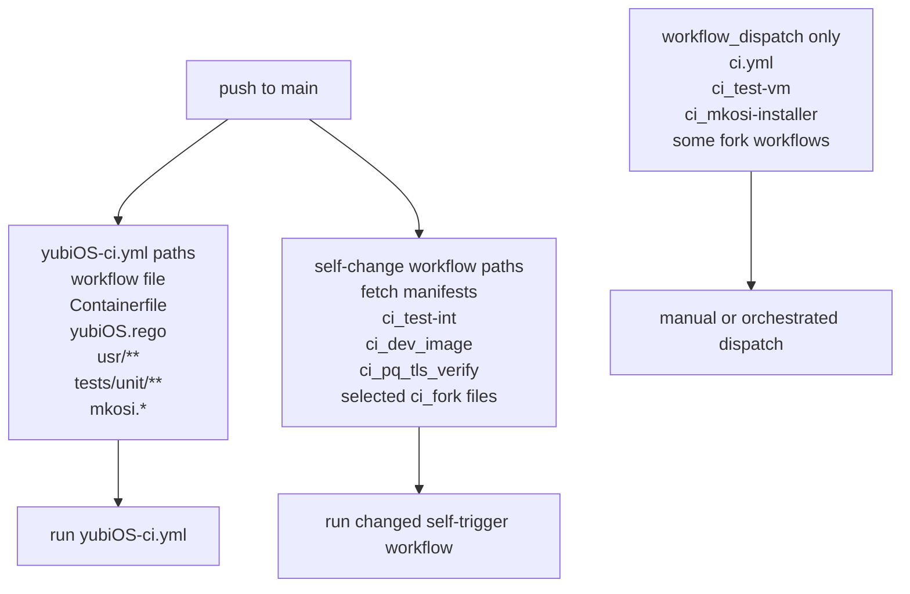

## Artifact and Registry Output Map

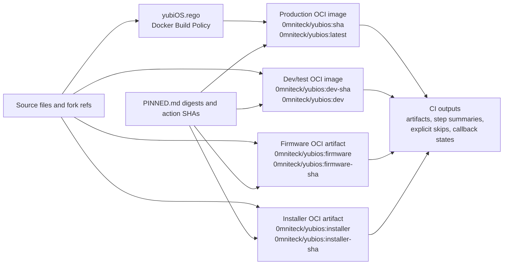

## Callback Contract

Every orchestrated child workflow accepts the same internal callback fields. The child workflow computes an aggregate result from `needs`, then dispatches `ci.yml` so the state machine can proceed.

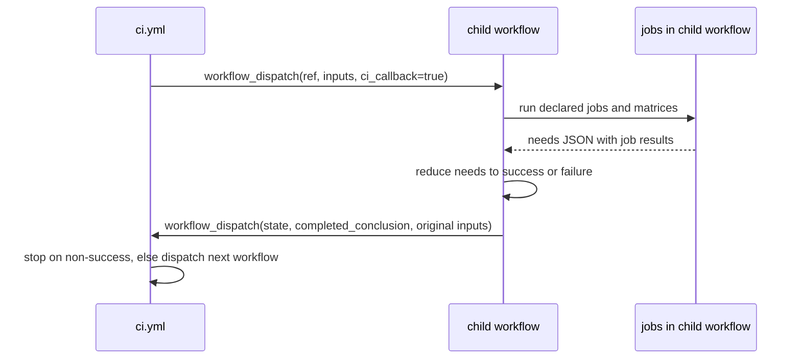
