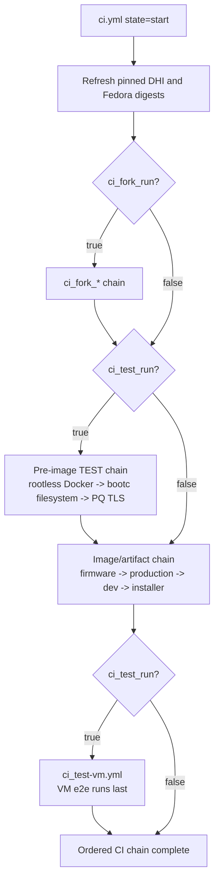
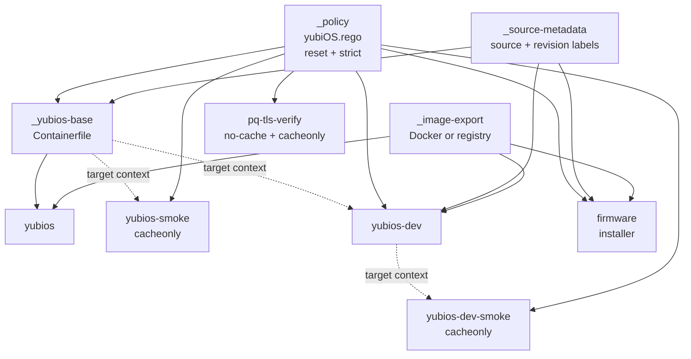
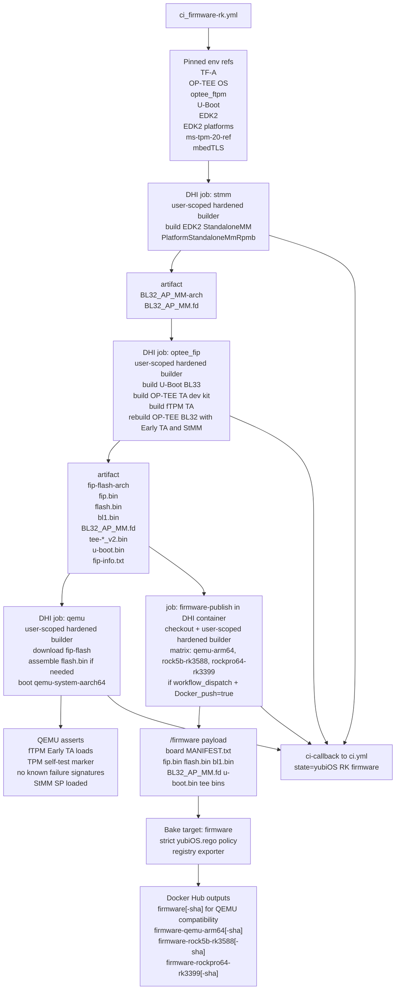
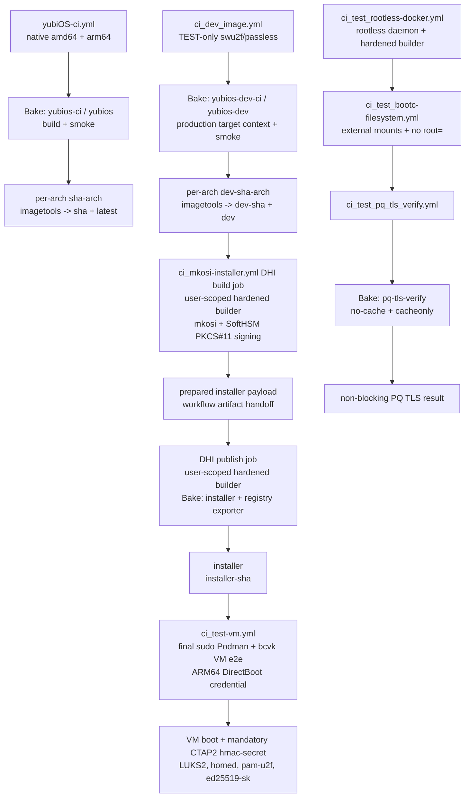
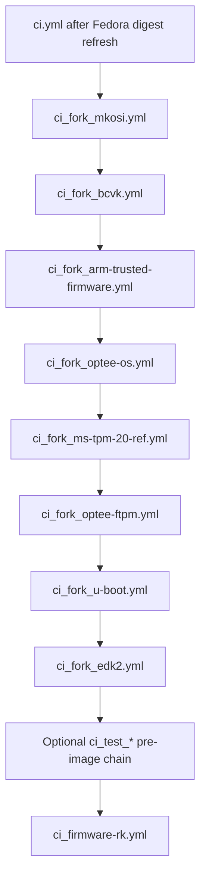
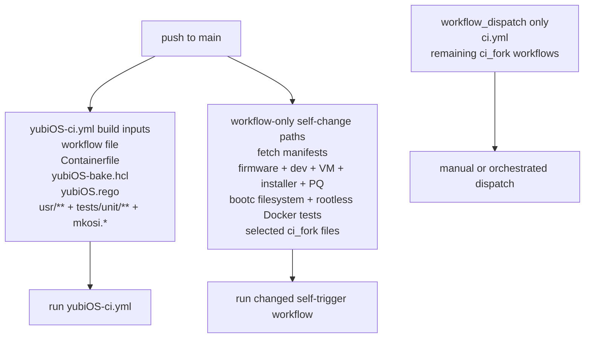
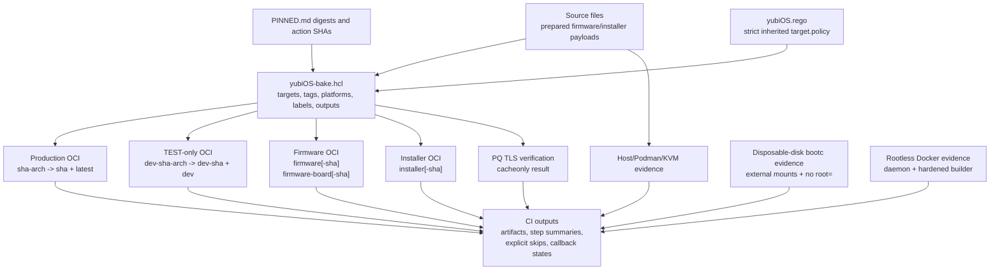
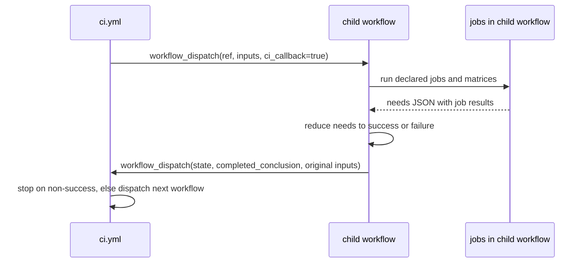

# CI_MAP.md

Regenerated from the `main` workflow shape on 2026-07-22 UTC.

This map treats `.github/workflows/*.yml` as the source of truth for events, runners, jobs, artifacts, and callback handoffs. `yubiOS-bake.hcl` is the source of truth for every Docker build in the non-`ci_fork*` chain dispatched by `ci.yml`. `PINNED.md` remains the source of truth for approved action SHAs and image digests.

## Workflow Inventory

| Workflow file | Role | Main inputs | Main outputs |
|---|---|---|---|
| `.github/workflows/ci.yml` | Top-level state machine | callback state, target ref, four publish flags, fork gate, TEST gate, VM image | Dispatches the next workflow in the ordered chain |
| `.github/workflows/fetch-dhi-manifest.yml` | DHI base digest refresh | `dhi.io/debian-base:trixie-debian13-dev`, `PINNED.md` | Updated DHI digest refs committed by workflow when drift exists |
| `.github/workflows/fetch-fedora-bootc-manifest.yml` | Fedora bootc digest refresh | `quay.io/fedora/fedora-bootc:45`, `PINNED.md` | Updated Fedora bootc digest refs committed by workflow when drift exists |
| `.github/workflows/ci_firmware-rk.yml` | Orchestrated ARM64/RK firmware integration and publish lane | yubi-OS firmware forks, pinned refs, board matrix, `yubiOS-bake.hcl` | `BL32_AP_MM.fd`, `fip.bin`, `flash.bin`, QEMU verification, optional original and board-scoped firmware tags through Bake |
| `.github/workflows/yubiOS-ci.yml` | Production image build and publish | `Containerfile`, `yubiOS-bake.hcl`, `yubiOS.rego`, `usr/**`, unit tests | Bake build/smoke results; optional per-arch tags and multi-arch `0mniteck/yubios:<sha>` plus `latest` |
| `.github/workflows/ci_dev_image.yml` | TEST-only image with software FIDO2 | `Containerfile.dev`, production target context, `yubiOS-bake.hcl`, `yubiOS.rego` | Bake build/smoke results; optional `0mniteck/yubios:dev-<sha>` and `dev` |
| `.github/workflows/ci_mkosi-installer.yml` | mkosi disk image and installer artifact | `mkosi.conf`, `mkosi.conf.d/**`, SoftHSM PKCS#11 mock, `yubiOS-bake.hcl` | signed UKI verification, `yubiOS.raw.zst`, optional installer tags through Bake |
| `.github/workflows/ci_test_rootless-docker.yml` | Optional pre-image rootless Docker bootstrap validation | pinned Docker/Buildx downloads, pinned DHI container, amd64/arm64 matrix | rootless daemon and hardened Buildx builder verified across step boundaries, callback state |
| `.github/workflows/ci_test_bootc-filesystem.yml` | Optional pre-image fresh-VM `bootc install to-filesystem` e2e | resolved yubiOS image digest, disposable GPT disk, externally mounted `/mnt` and `/mnt/boot` | amd64/arm64 install proof, retained mounts under `--skip-finalize`, proof that `root=` is omitted, callback state |
| `.github/workflows/ci_test_pq_tls_verify.yml` | Optional pre-image PQ hybrid TLS drift check | `yubiOS-bake.hcl`, `yubiOS.rego`, pinned DHI base, live TLS endpoint | uncached, non-blocking Bake verification result, callback state |
| `.github/workflows/ci_test-vm.yml` | Final VM e2e test when `ci_test_run=true` | pullable TEST-only yubiOS image, bcvk source, Podman storage, VM scripts | bcvk capability gate, DirectBoot SSH credential transport, mandatory CTAP2/LUKS2/homed/ed25519-sk assertions, callback state |
| `.github/workflows/ci_fork_*.yml` | Optional fork component checks | yubi-OS fork feature branches | component build/lint/test artifacts and callback state |

The older `ci_int_stmm.yml`, `ci_int_optee_fip.yml`, and `ci_int_qemu.yml` lane names are not separate files on current `main`. Their StMM, OP-TEE/FIP, and QEMU stages are embedded in the firmware integration workflows.

## Top-Level State Machine

`ci.yml` is the coordinator. Each child workflow reports back by dispatching `ci.yml` with `state=<completed workflow name>` and `completed_conclusion=<success|failure|cancelled>`. The coordinator stops on non-success before dispatching the next workflow.

Every child returns to the `ci.yml` dispatcher between nodes. Both `ci_fork_run` and `ci_test_run` are carried through every callback, so the fork branch, pre-image TEST branch, and final VM decision remain stable for the full chain.

## Canonical Docker Bake Graph

The merged `yubiOS-bake.hcl` replaces workflow-local `docker build` and `docker buildx build` commands in every non-fork workflow dispatched by `ci.yml`. GitHub Actions still owns event handling, runner selection, Docker/Buildx installation, active-builder selection, artifact transfer, host/Podman/KVM work, and final multi-architecture index assembly. The design rationale and Docker primary-source trail are recorded in [the Bake consolidation note](refs/docker-bake-consolidation-2026-07-17.md).

Four hidden targets provide the shared contract:

- `_policy` loads exactly one `yubiOS.rego` policy with `reset=true` and `strict=true`;
- `_source-metadata` supplies the source and revision OCI labels;
- `_image-export` selects Docker output when `PUSH=false` and registry output when `PUSH=true`; and
- `_yubios-base` defines the pinned production `Containerfile` build consumed by production and dev targets.

| Workflow | CI target/group | Explicit publication target | Builder ownership |
|---|---|---|---|
| `yubiOS-ci.yml` | `yubios-ci` (`yubios` + `yubios-smoke`) | `yubios` | Containerized job creates and names user-scoped `hardened` builder |
| `ci_dev_image.yml` | `yubios-dev-ci` (`yubios-dev` + `yubios-dev-smoke`) | `yubios-dev` | Containerized job creates and names user-scoped `hardened` builder |
| `ci_firmware-rk.yml` | None unless publication is requested | `firmware` | Every Stage 1–4 job uses the pinned DHI container and creates a user-scoped `hardened` builder |
| `ci_mkosi-installer.yml` | DHI-contained mkosi validation plus artifact handoff | `installer` | Every build and publication job uses the pinned DHI container and creates a user-scoped `hardened` builder |
| `ci_test_pq_tls_verify.yml` | `pq-tls-verify` | None; output is `cacheonly` | Containerized job creates and names user-scoped `hardened` builder |

Production and dev publication remains a two-stage operation: native runners publish immutable per-architecture tags through Bake, then existing `imagetools` jobs create the `<sha>`/`latest` and `dev-<sha>`/`dev` multi-architecture indexes. Firmware and installer targets publish directly with the registry exporter from privileged DHI container jobs that check out the policy-bound Bake definition and explicitly select their user-scoped `hardened` builders.

## ARM64/RK Firmware Integration

`ci_firmware-rk.yml` is the orchestrated firmware lane. Every build, verification, and publication stage runs in the pinned multi-arch DHI container and installs Docker/Buildx through the shared `wcurl` pattern, creating a user-scoped `hardened` builder. The workflow preserves the firmware integration shape, prepares one board payload per matrix entry, then invokes the Bake `firmware` target with `PUSH=true` when publication is requested. The QEMU board retains the compatibility `firmware` tags; every publishable board receives board-scoped tags.

The removed `ci_test-int.yml` workflow remains historical context only; `ci.yml` dispatches `ci_firmware-rk.yml` and waits for its `yubiOS RK firmware` callback state.

## TEST, Production, Dev, Installer, and Final VM Lanes

The VM lane intentionally remains outside Bake. bcvk hardcodes Podman for its privileged ephemeral container and reads from Podman's local image store, so the workflow pulls the selected image with `sudo podman`. Guest SSH runs from inside that outer container. For ARM64 DirectBoot, the public root key is delivered without firmware through systemd's kernel-command-line `tmpfiles.extra` credential path. The TEST image pins passless v0.11.2 to an immutable commit and enables soft-fido2's implemented `hmac-secret` extension during the build. Once it boots, passless/CTAP2 enumeration and the LUKS2, homed, pam-u2f, and OpenSSH security-key operations are hard assertions rather than skip-tolerant coverage.

The installer self-change push trigger validates mkosi without publishing. Only a `workflow_dispatch` with `Docker_push=true` uploads the prepared `inst/installer` payload, hands it to the containerized publish job, and packages it through the policy-bound Bake `installer` target.

## Optional Fork Component CI

When `ci_fork_run=true`, `ci.yml` runs component workflows before the optional pre-image TEST chain and firmware integration. They validate yubi-OS fork feature branches but do not stitch a full firmware image; stitching happens in `ci_firmware-rk.yml`.

## Push Triggers and Self-Change Validation

The orchestrated path is `workflow_dispatch` driven. Narrow `push` triggers validate current-main workflow edits without starting the callback chain; every callback is guarded by both `github.event_name == 'workflow_dispatch'` and `ci_callback == true`.

## Artifact and Registry Output Map

## Callback Contract

Every orchestrated child workflow accepts the same internal callback fields, including the carried `ci_fork_run` and `ci_test_run` choices. The child workflow computes an aggregate result from `needs`, then dispatches `ci.yml` so the state machine can proceed. `state` is the workflow display name from `github.workflow`, not necessarily the filename; for example, the installer reports `yubiOS mkosi-installer`, which is the exact state matched by current `ci.yml`.

## Workflow Job and Step Tree

The exact dispatch order is defined by the state-machine graph above. The detailed job trees below are grouped by lane for readability. Each job contains every declared `jobs.<job>.steps` entry in execution order. Matrix jobs are shown once; job and step `if` conditions still determine whether an entry runs for a particular event or matrix leg. GitHub-generated setup and cleanup operations are not declared workflow steps and are omitted.

- Workflow details
  - [`ci.yml`](.github/workflows/ci.yml) — workflow: `CI`
    - Job `dispatch-next` — `Dispatch next workflow from current state`
      - Step 1: `Resolve and dispatch next workflow`
  - [`fetch-dhi-manifest.yml`](.github/workflows/fetch-dhi-manifest.yml) — workflow: `fetch-dhi-manifest`
    - Job `fetch` — `fetch`
      - Step 1: `Checkout yubiOS for PINNED.md update`
      - Step 2: `Fetch dhi.io Debian base manifest and update pinned refs`
    - Job `ci-callback` — `Callback to ci.yml orchestrator`
      - Step 1: `Report current state to ci.yml`
  - [`fetch-fedora-bootc-manifest.yml`](.github/workflows/fetch-fedora-bootc-manifest.yml) — workflow: `fetch-fedora-bootc-manifest`
    - Job `fetch` — `fetch`
      - Step 1: `Checkout yubiOS for PINNED.md update`
      - Step 2: `Fetch Fedora bootc manifest and update pinned refs`
    - Job `ci-callback` — `Callback to ci.yml orchestrator`
      - Step 1: `Report current state to ci.yml`
  - [`ci_firmware-rk.yml`](.github/workflows/ci_firmware-rk.yml) — workflow: `yubiOS RK firmware`
    - Job `stmm` — `Stage 1 - BL32_AP_MM.fd (StandaloneMM RPMB, AARCH64) ${{ matrix.arch }}`
      - Step 1: `Checkout`
      - Step 2: `Install docker CLI + buildx (${{ matrix.arch }})`
      - Step 3: `Install EDK2 build deps`
      - Step 4: `Clone edk2 + edk2-platforms`
      - Step 5: `Resolve AARCH64 cross prefix`
      - Step 6: `Build BaseTools`
      - Step 7: `Build StandaloneMM RPMB platform`
      - Step 8: `Stage BL32_AP_MM.fd`
      - Step 9: `Upload BL32_AP_MM.fd`
    - Job `optee_fip` — `Stage 2 - ${{ matrix.board }} OP-TEE/TF-A/U-Boot ${{ matrix.arch }}`
      - Step 1: `Checkout`
      - Step 2: `Install docker CLI + buildx (${{ matrix.arch }})`
      - Step 3: `Install full ARM64 firmware toolchain`
      - Step 4: `Download BL32_AP_MM.fd from stmm job`
      - Step 5: `Clone U-Boot and stage yubiOS fTPM fragment`
      - Step 6: `Build QEMU U-Boot BL33`
      - Step 7: `Stage StMM artifact`
      - Step 8: `Build OP-TEE TA dev kit`
      - Step 9: `Build fTPM TA`
      - Step 10: `Rebuild OP-TEE BL32 folding fTPM Early TA and StMM`
      - Step 11: `Build TF-A trusted firmware`
      - Step 12: `Verify FIP contents`
      - Step 13: `Build Rockchip U-Boot board image`
      - Step 14: `Write firmware artifact manifest`
      - Step 15: `Upload fip + flash artifacts`
    - Job `qemu` — `Stage 3 - QEMU fTPM e2e (${{ matrix.arch }})`
      - Step 1: `Checkout`
      - Step 2: `Install docker CLI + buildx (${{ matrix.arch }})`
      - Step 3: `Install QEMU + TPM tooling`
      - Step 4: `Clean QEMU artifact directory`
      - Step 5: `Download fip/flash from optee_fip job`
      - Step 6: `Resolve or assemble flash.bin`
      - Step 7: `Boot stitched image under QEMU and assert fTPM markers`
      - Step 8: `Loud skip when no bootable image exists`
    - Job `firmware-publish` — `Stage 4 - Publish firmware bundle (${{ matrix.board }})`
      - Step 1: `Checkout`
      - Step 2: `Clean firmware publish workspace`
      - Step 3: `Download firmware artifacts (native arm64 build)`
      - Step 4: `RK3588 TPL publish gate`
      - Step 5: `Install docker CLI + buildx`
      - Step 6: `Assemble board-scoped /firmware payload`
      - Step 7: `Log in to Docker Hub`
      - Step 8: `Build and push firmware OCI artifact through Bake`
      - Step 9: `Verify pushed board tag`
    - Job `ci-callback` — `Callback to ci.yml orchestrator`
      - Step 1: `Report current state to ci.yml`
  - [`yubiOS-ci.yml`](.github/workflows/yubiOS-ci.yml) — workflow: `yubiOS CI`
    - Job `shellcheck` — `shellcheck`
      - Step 1: `Checkout`
      - Step 2: `shellcheck`
    - Job `hadolint` — `hadolint`
      - Step 1: `Checkout`
      - Step 2: `hadolint (Containerfile lint)`
    - Job `unit-tests` — `unit-tests`
      - Step 1: `Checkout`
      - Step 2: `Install test dependencies`
      - Step 3: `Run unit tests (${{ matrix.arch }})`
    - Job `mkosi` — `mkosi`
      - Step 1: `Checkout`
      - Step 2: `Install mkosi (from yubi-OS fork)`
      - Step 3: `Validate mkosi config (${{ matrix.arch }})`
    - Job `build` — `build`
      - Step 1: `Checkout`
      - Step 2: `Install docker CLI + buildx (${{ matrix.arch }})`
      - Step 3: `Log in to Docker Hub`
      - Step 4: `Build OCI image (${{ matrix.arch }})`
      - Step 5: `Push per-arch image (${{ matrix.arch }})`
    - Job `merge-manifest` — `merge-manifest`
      - Step 1: `Install docker CLI + buildx`
      - Step 2: `Log in to Docker Hub`
      - Step 3: `Create + push multi-arch manifest`
      - Step 4: `Verify manifest list`
    - Job `ci-callback` — `Callback to ci.yml orchestrator`
      - Step 1: `Report current state to ci.yml`
  - [`ci_dev_image.yml`](.github/workflows/ci_dev_image.yml) — workflow: `yubiOS dev/test image (swu2f, ADR-026)`
    - Job `build` — `build`
      - Step 1: `Checkout`
      - Step 2: `Install docker CLI + buildx (${{ matrix.arch }})`
      - Step 3: `Log in to Docker Hub`
      - Step 4: `Build and verify dev/test image (${{ matrix.arch }})`
      - Step 5: `Push per-arch dev image (${{ matrix.arch }})`
    - Job `merge-manifest` — `merge-manifest`
      - Step 1: `Install docker CLI + buildx`
      - Step 2: `Log in to Docker Hub`
      - Step 3: `Guard dev/test manifest tags`
      - Step 4: `Create + push multi-arch dev manifest`
      - Step 5: `Verify manifest list`
    - Job `ci-callback` — `Callback to ci.yml orchestrator`
      - Step 1: `Report current state to ci.yml`
  - [`ci_test-vm.yml`](.github/workflows/ci_test-vm.yml) — workflow: `yubiOS VM e2e (tests/vm)`
    - Job `lint-vm-scripts` — `lint-vm-scripts`
      - Step 1: `Checkout`
      - Step 2: `shellcheck + bash -n on tests/vm/*.sh`
    - Job `vm-e2e` — `vm-e2e`
      - Step 1: `Checkout`
      - Step 2: `Free disk space (self-hosted rock1 persists disk across runs -- unlike hosted runners)`
      - Step 3: `Install host deps (swtpm + qemu + fido2 + cryptsetup)`
      - Step 4: `Install zstd-capable QEMU for ARM64 DirectBoot`
      - Step 5: `Disk space before bcvk build (diagnostic)`
      - Step 6: `Free disk space (pre-build -- kill stray containers from an aborted prior run)`
      - Step 7: `Build bcvk @ feat/swtpm-ci (feasibility gate)`
      - Step 8: `Disk space after bcvk build attempt (diagnostic)`
      - Step 9: `Gate on KVM (bcvk hard-requires /dev/kvm; now real hardware on arm64 via self-hosted rock1)`
      - Step 10: `Gate amd64 boot leg on platform-priority policy (ADR-023: ARM64 is primary)`
      - Step 11: `Assert bcvk exposes --swtpm/--swu2f (real regression gate)`
      - Step 12: `Free disk space (pre-pull -- reclaim space the cargo build just used)`
      - Step 13: `Pull yubiOS image into podman storage (bcvk boots from local storage)`
      - Step 14: `Relax AppArmor profiles for bcvk VM boot`
      - Step 15: `Run tests/vm/test-luks-fido2-ci.sh (boot leg gated on image availability)`
      - Step 16: `Run tests/vm/test-fido2-enrollment.sh (enrollment surface,`
      - Step 17: `Free disk space (post-run -- leave rock1 clean for the next run)`
      - Step 18: `Note hardware-only variant (lint-only in CI)`
    - Job `ci-callback` — `Callback to ci.yml orchestrator`
      - Step 1: `Report current state to ci.yml`
  - [`ci_mkosi-installer.yml`](.github/workflows/ci_mkosi-installer.yml) — workflow: `yubiOS mkosi-installer`
    - Job `build` — `mkosi disk image — SoftHSM PKCS#11 signed UKI`
      - Step 1: `Checkout`
      - Step 2: `Install docker CLI + buildx`
      - Step 3: `Install mkosi build deps + mkosi (yubi-OS fork @ main)`
      - Step 4: `SoftHSM token in /run — mock of YubiKey PIV slot 9c`
      - Step 5: `Build disk image (minimal profile, PKCS#11-signed UKI)`
      - Step 6: `Verify UKI is signed by the PKCS#11 (SoftHSM) key`
      - Step 7: `Assemble /installer payload + MANIFEST`
      - Step 8: `Upload prepared installer payload`
    - Job `installer-publish` — `Publish installer OCI artifact`
      - Step 1: `Checkout`
      - Step 2: `Download prepared installer payload`
      - Step 3: `Install docker CLI + buildx`
      - Step 4: `Build and push installer OCI artifact through Bake`
    - Job `ci-callback` — `Callback to ci.yml orchestrator`
      - Step 1: `Report current state to ci.yml`
  - [`ci_test_pq_tls_verify.yml`](.github/workflows/ci_test_pq_tls_verify.yml) — workflow: `TEST - PQ hybrid TLS verification (ADR-025)`
    - Job `pq-tls-verify` — `pq-tls-verify`
      - Step 1: `Checkout`
      - Step 2: `Install docker CLI + buildx`
      - Step 3: `Verify PQ hybrid TLS through the policy-bound Bake target`
    - Job `ci-callback` — `Callback to ci.yml orchestrator`
      - Step 1: `Report current state to ci.yml`

## Pre-Image TEST Workflow Detail and Self-Change Evidence

When `ci_test_run=true`, these workflows run after the optional `ci_fork_*` chain and before any image build. Their narrow push triggers remain: a push to `main` runs each workflow only when its own file changes, without activating its callback. Maintainers can also dispatch each workflow manually.

Initial self-change evidence is green: [bootc install run 29884493346](https://github.com/yubi-OS/yubiOS/actions/runs/29884493346) passed the amd64 and arm64 disposable-disk legs, and [rootless Docker run 29884493340](https://github.com/yubi-OS/yubiOS/actions/runs/29884493340) passed both architecture legs.

- [`ci_test_bootc-filesystem.yml`](.github/workflows/ci_test_bootc-filesystem.yml) — workflow: `TEST - bootc to-filesystem install e2e`
  - Job `install-to-filesystem` — `install-to-filesystem (${{ matrix.arch }})`, native amd64/arm64 matrix on fresh hosted VMs
    - Step 1: `Checkout`
    - Step 2: `Assert README install contract`
    - Step 3: `Prepare fresh externally partitioned target at /mnt`
    - Step 4: `Resolve image digest and install with the README command`
    - Step 5: `Verify installed deployment and omitted root= argument`
    - Step 6: `Detach disposable target`
  - Job `ci-callback` — `Callback to ci.yml orchestrator`
    - Step 1: `Report current state to ci.yml`
- [`ci_test_rootless-docker.yml`](.github/workflows/ci_test_rootless-docker.yml) — workflow: `TEST - Rootless Docker bootstrap validation`
  - Job `rootless-docker` — native amd64/arm64 matrix inside the pinned privileged DHI container
    - Step 1: `Exercise rootless Docker bootstrap (${{ matrix.arch }})`
    - Step 2: `Verify rootless Docker across the step boundary (${{ matrix.arch }})`
  - Job `ci-callback` — `Callback to ci.yml orchestrator`
    - Step 1: `Report current state to ci.yml`
