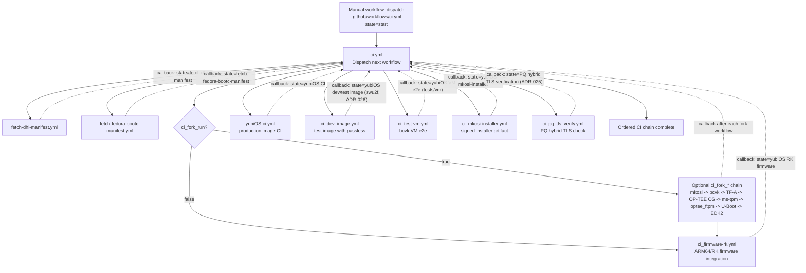
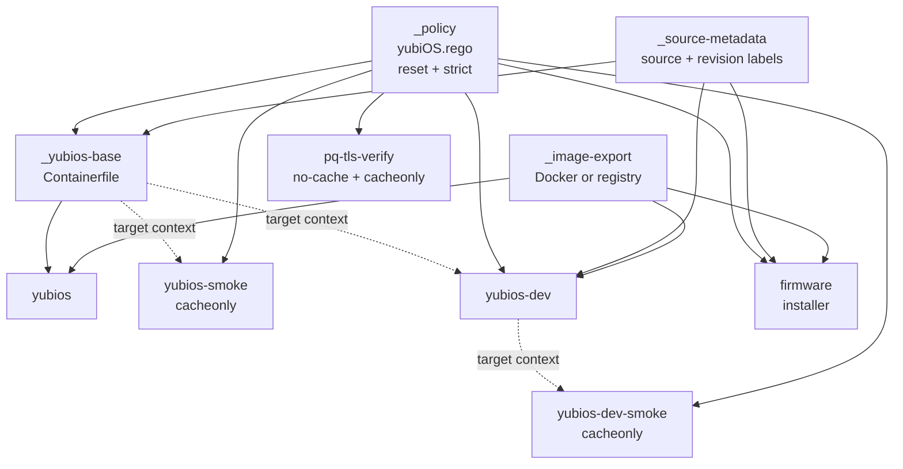
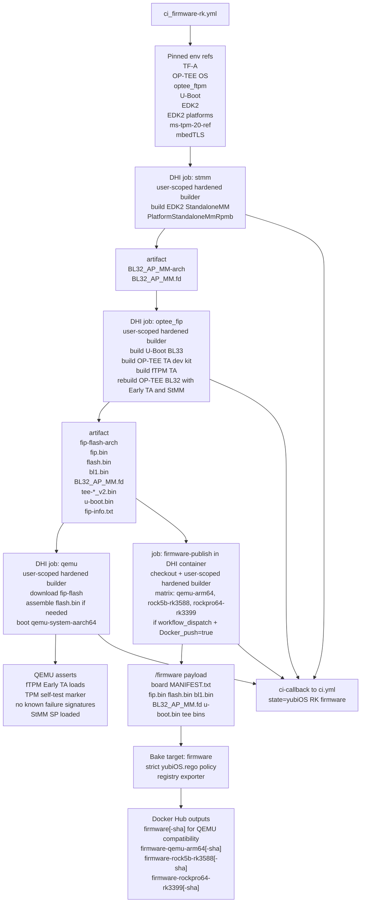
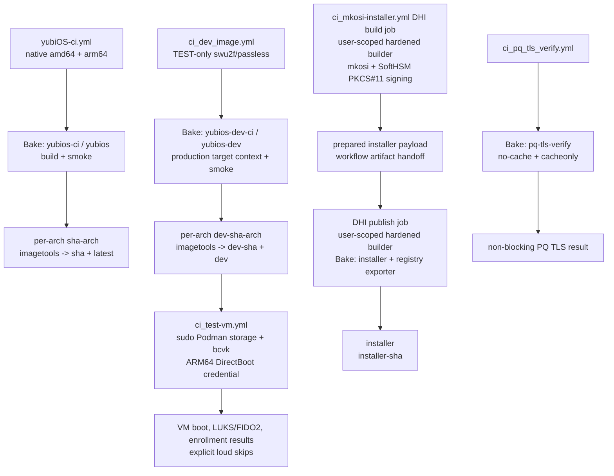
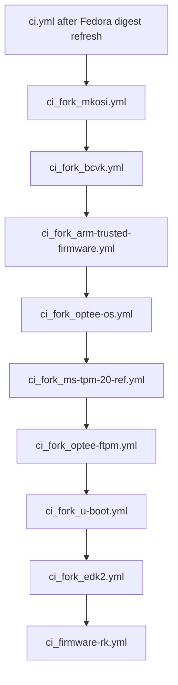
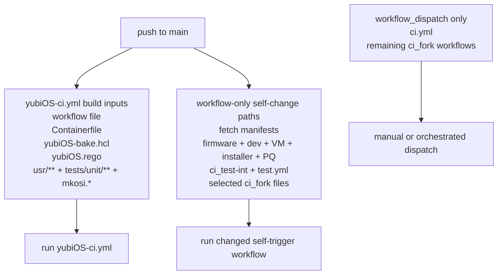
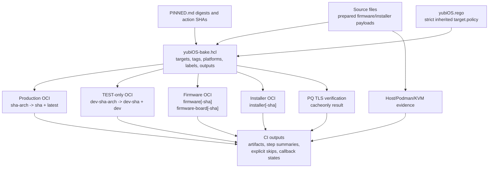
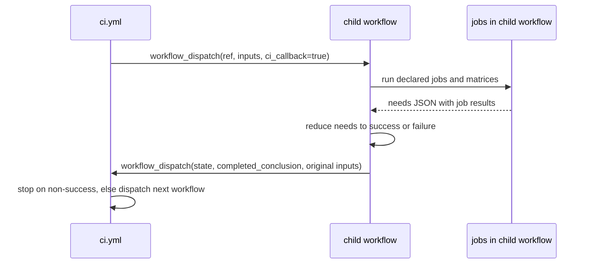

# CI_MAP.md

Regenerated from the `main` workflow shape at `7809d5c` on 2026-07-20 UTC.

This map treats `.github/workflows/*.yml` as the source of truth for events, runners, jobs, artifacts, and callback handoffs. `yubiOS-bake.hcl` is the source of truth for every Docker build in the non-`ci_fork*` chain dispatched by `ci.yml`. `PINNED.md` remains the source of truth for approved action SHAs and image digests.

## Workflow Inventory

| Workflow file | Role | Main inputs | Main outputs |
|---|---|---|---|
| `.github/workflows/ci.yml` | Top-level state machine | callback state, target ref, four publish flags, fork gate, VM image | Dispatches the next workflow in the ordered chain |
| `.github/workflows/fetch-dhi-manifest.yml` | DHI base digest refresh | `dhi.io/debian-base:trixie-debian13-dev`, `PINNED.md` | Updated DHI digest refs committed by workflow when drift exists |
| `.github/workflows/fetch-fedora-bootc-manifest.yml` | Fedora bootc digest refresh | `quay.io/fedora/fedora-bootc:45`, `PINNED.md` | Updated Fedora bootc digest refs committed by workflow when drift exists |
| `.github/workflows/ci_firmware-rk.yml` | Orchestrated ARM64/RK firmware integration and publish lane | yubi-OS firmware forks, pinned refs, board matrix, `yubiOS-bake.hcl` | `BL32_AP_MM.fd`, `fip.bin`, `flash.bin`, QEMU verification, optional original and board-scoped firmware tags through Bake |
| `.github/workflows/ci_test-int.yml` | Legacy/manual ARM64 fTPM firmware integration reference | same firmware source family as the RK lane | manual QEMU firmware verification and optional historical `firmware` tags; no longer in the top-level `ci.yml` path |
| `.github/workflows/yubiOS-ci.yml` | Production image build and publish | `Containerfile`, `yubiOS-bake.hcl`, `yubiOS.rego`, `usr/**`, unit tests | Bake build/smoke results; optional per-arch tags and multi-arch `0mniteck/yubios:<sha>` plus `latest` |
| `.github/workflows/ci_dev_image.yml` | TEST-only image with software FIDO2 | `Containerfile.dev`, production target context, `yubiOS-bake.hcl`, `yubiOS.rego` | Bake build/smoke results; optional `0mniteck/yubios:dev-<sha>` and `dev` |
| `.github/workflows/ci_test-vm.yml` | VM e2e tests | pullable yubiOS image, bcvk source, Podman storage, VM scripts | bcvk capability gate, DirectBoot SSH credential transport, VM enrollment results, callback state |
| `.github/workflows/ci_mkosi-installer.yml` | mkosi disk image and installer artifact | `mkosi.conf`, `mkosi.conf.d/**`, SoftHSM PKCS#11 mock, `yubiOS-bake.hcl` | signed UKI verification, `yubiOS.raw.zst`, optional installer tags through Bake |
| `.github/workflows/ci_pq_tls_verify.yml` | PQ hybrid TLS drift check | `yubiOS-bake.hcl`, `yubiOS.rego`, pinned DHI base, live TLS endpoint | uncached, non-blocking Bake verification result |
| `.github/workflows/test.yml` | Standalone self-hosted ARM64/KVM diagnostic | pullable yubiOS image, Podman, bcvk/QEMU host capabilities | QEMU kernel bind-mount diagnostics; not in the `ci.yml` chain |
| `.github/workflows/ci_fork_*.yml` | Optional fork component checks | yubi-OS fork feature branches | component build/lint/test artifacts and callback state |

The older `ci_int_stmm.yml`, `ci_int_optee_fip.yml`, and `ci_int_qemu.yml` lane names are not separate files on current `main`. Their StMM, OP-TEE/FIP, and QEMU stages are embedded in the firmware integration workflows.

## Top-Level State Machine

`ci.yml` is the coordinator. Each child workflow reports back by dispatching `ci.yml` with `state=<completed workflow name>` and `completed_conclusion=<success|failure|cancelled>`. The coordinator stops on non-success before dispatching the next workflow.

## Canonical Docker Bake Graph

The merged `yubiOS-bake.hcl` replaces workflow-local `docker build` and `docker buildx build` commands in every non-fork workflow dispatched by `ci.yml`. GitHub Actions still owns event handling, runner selection, Docker/Buildx installation, active-builder selection, artifact transfer, host/Podman/KVM work, and final multi-architecture index assembly. The design rationale and Docker primary-source trail are recorded in [the Bake consolidation note](refs/docker-bake-consolidation-2026-07-17.md).

Four hidden targets provide the shared contract:

- `_policy` loads exactly one `yubiOS.rego` policy with `reset=true` and `strict=true`;
- `_source-metadata` supplies the source and revision OCI labels;
- `_image-export` selects Docker output when `PUSH=false` and registry output when `PUSH=true`; and
- `_yubios-base` defines the pinned production `Containerfile` build consumed by production and dev targets.

| Workflow | CI target/group | Explicit publication target | Builder ownership |
|---|---|---|---|
| `yubiOS-ci.yml` | `yubios-ci` (`yubios` + `yubios-smoke`) | `yubios` | Containerized job creates and names user-scoped `hardened` builder |
| `ci_dev_image.yml` | `yubios-dev-ci` (`yubios-dev` + `yubios-dev-smoke`) | `yubios-dev` | Containerized job creates and names user-scoped `hardened` builder |
| `ci_firmware-rk.yml` | None unless publication is requested | `firmware` | Every Stage 1–4 job uses the pinned DHI container and creates a user-scoped `hardened` builder |
| `ci_mkosi-installer.yml` | DHI-contained mkosi validation plus artifact handoff | `installer` | Every build and publication job uses the pinned DHI container and creates a user-scoped `hardened` builder |
| `ci_pq_tls_verify.yml` | `pq-tls-verify` | None; output is `cacheonly` | Containerized job creates and names user-scoped `hardened` builder |

Production and dev publication remains a two-stage operation: native runners publish immutable per-architecture tags through Bake, then existing `imagetools` jobs create the `<sha>`/`latest` and `dev-<sha>`/`dev` multi-architecture indexes. Firmware and installer targets publish directly with the registry exporter from privileged DHI container jobs that check out the policy-bound Bake definition and explicitly select their user-scoped `hardened` builders.

## ARM64/RK Firmware Integration

`ci_firmware-rk.yml` is the orchestrated firmware lane. Every build, verification, and publication stage runs in the pinned multi-arch DHI container and installs Docker/Buildx through the shared `wcurl` pattern, creating a user-scoped `hardened` builder. The workflow preserves the firmware integration shape, prepares one board payload per matrix entry, then invokes the Bake `firmware` target with `PUSH=true` when publication is requested. The QEMU board retains the compatibility `firmware` tags; every publishable board receives board-scoped tags.

`ci_test-int.yml` remains available for manual/historical comparison, but `ci.yml` no longer dispatches it and no longer waits for a `yubiOS firmware` callback state.

## Production, Dev, VM, Installer, and PQ Lanes

The VM lane intentionally remains outside Bake. bcvk hardcodes Podman for its privileged ephemeral container and reads from Podman's local image store, so the workflow pulls the selected image with `sudo podman`. Guest SSH runs from inside that outer container. For ARM64 DirectBoot, the public root key is delivered without firmware through systemd's kernel-command-line `tmpfiles.extra` credential path.

The installer self-change push trigger validates mkosi without publishing. Only a `workflow_dispatch` with `Docker_push=true` uploads the prepared `inst/installer` payload, hands it to the containerized publish job, and packages it through the policy-bound Bake `installer` target.

## Optional Fork Component CI

When `ci_fork_run=true`, `ci.yml` runs component workflows before firmware integration. They validate yubi-OS fork feature branches but do not stitch a full firmware image; stitching happens in `ci_firmware-rk.yml`.

## Push Triggers and Self-Change Validation

The orchestrated path is `workflow_dispatch` driven. Narrow `push` triggers validate current-main workflow edits without starting the callback chain; every callback is guarded by both `github.event_name == 'workflow_dispatch'` and `ci_callback == true`.

## Artifact and Registry Output Map

## Callback Contract

Every orchestrated child workflow accepts the same internal callback fields. The child workflow computes an aggregate result from `needs`, then dispatches `ci.yml` so the state machine can proceed. `state` is the workflow display name from `github.workflow`, not necessarily the filename; for example, the installer reports `yubiOS mkosi-installer`, which is the exact state matched by current `ci.yml`.

