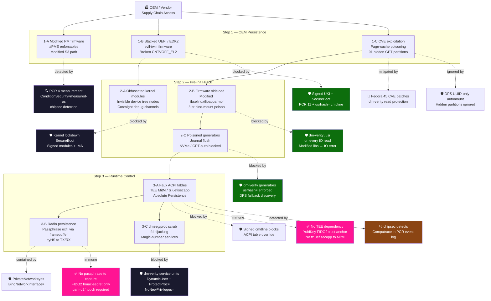

# yubiOS Mitigation Matrix

Last reviewed: 2026-07-11
Status: planning baseline for `main`

This document maps the main yubiOS threat surfaces to current mitigations and open gaps. It is intentionally concrete: if the project cannot currently mitigate something, that is stated plainly.

## Threat Model Summary

| Area | Assumption |
|---|---|
| Owner | The owner controls the YubiKey, recovery key, Secure Boot enrollment, and installation target |
| Attacker | May control the network, registry mirror, disk at rest, or a stolen powered-off device |
| Strong attacker | May have temporary physical access, malicious firmware supply chain influence, or compromised CI inputs |
| Out of scope | Defeating a malicious CPU/SoC, closed-source ROM behavior, or an owner who enrolls malicious keys |

## Primary Mitigations

| Threat | Mitigation | Residual risk |
|---|---|---|
| Disk theft | LUKS2 root/swap with FIDO2 hmac-secret, PIN, touch, and offline recovery key | An attacker with both YubiKey and PIN can unlock |
| Silent disk decryption | FIDO2 physical presence and PIN | Malware running after unlock can access mounted plaintext while the session is active |
| Mutable `/usr` tampering | composefs over erofs with dm-verity and signed UKI command line | Firmware or kernel compromise can subvert checks below Linux |
| Malicious base image drift | Digest pins in [PINNED.md](PINNED.md), build policy, provenance/SBOM | Pins require active refresh for security fixes |
| Secure Boot key substitution | Owner-enrolled db key, PIV-backed signing, `sbverify` in CI | OEM firmware behavior is still trusted on x86-64 |
| TPM-bound update lockout | FIDO2 hmac-secret avoids PCR-hash-bound LUKS unlock | FIDO2 does not prove which OS asked for the secret |
| Weak local auth | pam-u2f >= 1.3.1, `required` PAM flow | Emergency recovery paths must remain guarded and documented |
| Per-user data exposure | systemd-homed LUKS2 homes with per-user FIDO2 credentials | Active logged-in session remains plaintext to that user's processes |
| Registry TLS downgrade | OpenSSL 3.5+ and Go 1.24+ defaults for `X25519MLKEM768` | Server-side support and future library defaults must keep being checked |

## ARM64-Specific Risks

ARM64 is the primary platform because it enables an owner-owned root below the UKI, but that path is only as strong as the board provisioning evidence.

| Risk | Mitigation | Status |
|---|---|---|
| Vendor secure-world ownership | TF-A + OP-TEE + fTPM stack owned and pinned by yubiOS | Design accepted; hardware validation post-launch |
| Unsafe or irreversible fuse burns | Path A/Path B split, sacrificial-board rehearsal, explicit board classification | Planning baseline; not production-complete |
| RPi 5 Broadcom VideoCore trust anchor | Classified as Path B only | Documented; not a production Path A target |
| RPMB/fTPM NV bootstrap | OP-TEE RPMB-backed NV for production, volatile NV only in CI | Needs real-board proof |
| U-Boot console break-in | Proposed FIDO2/U2F console gate plus recovery plan | Idea-stage, not a current mitigation |
| CoreSight/debug exposure | Secure Boot lockdown and board policy | Needs per-board kernel/config verification |
| Qualcomm-style sideload paths | Prefer non-Qualcomm targets for Path A; dm-verity above firmware boundary | Hardware below firmware remains out of scope |

## x86-64-Specific Risks

x86-64 remains supported but secondary. Its firmware and TPM root are not yubiOS-owned.

| Risk | Mitigation | Residual risk |
|---|---|---|
| OEM UEFI compromise | Owner-enrolled Secure Boot keys above firmware | Cannot remove OEM firmware as a trust anchor today |
| TPM/fTPM vendor ownership | Do not make TPM the sole disk-unlock gate | Measurement evidence may still come from an OEM-controlled stack |
| VM CI false confidence | Keep VM CI as compatibility evidence, not hardware-root evidence | Bare-metal x86 remains separate from ARM64 Path A goals |

## Firmware Validation

`yubiOS-chipsec-firstboot.service` is a one-shot firmware validation service. It is allowed raw hardware access only because firmware inspection requires it, and that exception is explicitly scoped. The service warns by default; fleet deployments may choose fail-closed policy through kernel arguments.

CHIPSEC does not provide a reliable automated Absolute/Computrace verdict. The best current evidence is informational scanning for WPBT and relevant UEFI variables, not a pass/fail guarantee.

## systemd Hardening Notes

Use `RestrictFileSystems=` when a filesystem-type allow/deny policy is appropriate and the kernel has BPF LSM support. Do not describe this as a systemd v261-only feature. Track `RestrictFileSystemAccess=` separately as the v261 filesystem-access primitive to evaluate in future service audits.

## What yubiOS Cannot Fully Prevent

- A malicious or vulnerable CPU/SoC executing below the owner-controlled chain.
- Closed boot ROM or firmware stages that cannot be replaced or verified by the owner.
- Physical coercion of the owner into providing PIN, touch, or recovery material.
- Compromise after the system is unlocked and the owner session is active.
- Supply-chain compromise of a pinned source before the project detects and rotates the pin.

## Current Follow-Up

The active inconsistency and mitigation cleanup log is [refs/planning-cycle-2026-07-11.md](refs/planning-cycle-2026-07-11.md). It records the research sources used for the systemd, PQ TLS, bootc, and QEMU corrections.
