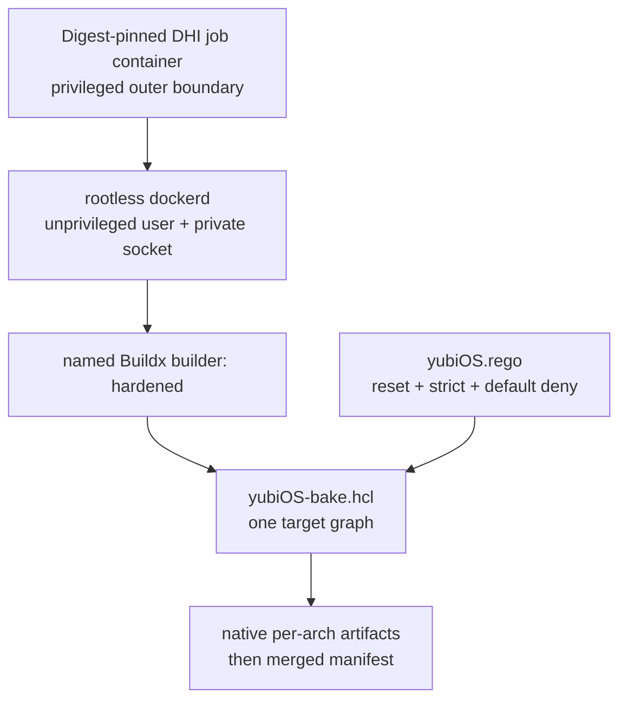

# Architecture Decision Records - yubiOS

Last reviewed: 2026-07-21

## ADR-001: YubiKey as TPM replacement

**Status:** Accepted

**Context:** Most secure-boot / disk-encryption stacks assume a TPM 2.0 chip.
TPMs are OEM-controlled, soldered to specific motherboards, and can be provisioned
with vendor keys the user never sees.

**Decision:** Use the YubiKey 5 series as the sole trust anchor.

**Rationale:**
- Hardware-bound key material that travels with the user, not the board
- Open specification (FIDO2/CTAP2, PIV/PKCS#11, OATH)
- Touch-required by default -- no silent decryption
- User-generated keys: no OEM or manufacturer trust chain

**Trade-offs:**
- Lost YubiKey = locked out without recovery key; document recovery in ONBOARDING.md
- Single point of failure; recommend enrolling a backup YubiKey
- FIDO2 credentials are device-bound; cannot be backed up cryptographically

---

## ADR-002: Secure Boot signing via PIV (CCID), not FIDO2 (hidraw)

**Status:** Accepted

**Context:** The user wants YubiKey /dev/hidraw* interfaces throughout.
Secure Boot UKI signing requires an asymmetric signing operation with a
certificate that can be enrolled in the UEFI Secure Boot `db`.

**Decision:** Use YubiKey PIV slot 9c (Digital Signature) via PKCS#11 for
Secure Boot key material. Interface: CCID (USB smartcard), not hidraw.

**Signing toolchain:** Use `systemd-sbsign` (systemd v257+; yubiOS base is now pinned to v261+, see ADR-015 and ADR-016) via `--key pkcs11:...`.
This replaces legacy `sbsigntools` (`sbsign --engine pkcs11`). Both speak PKCS#11;
systemd-sbsign integrates tighter with the UKI pipeline and is now the upstream default.

**Why not FIDO2 for signing:**
- FIDO2 HMAC-secret CAN wrap a signing key (key encrypted on disk, FIDO2
  derives the AES key), but neither `sbsign` nor `systemd-sbsign` support this path natively.
- PIV/PKCS#11 is directly supported and battle-tested in all signing tools.
- Source: https://developers.yubico.com/yubico-piv-tool/

**Future:** A fully hidraw-only signing path (FIDO2 HMAC-secret wrapping a
Secure Boot key) is tracked in TODO.md. `age-plugin-fido2-hmac` is a candidate.

**Consequence:** Users need `pcscd` running for PIV ops.

```bash
ykman config usb --enable FIDO --enable CCID
```

---

## ADR-003: LUKS2 + FIDO2 via systemd-cryptenroll (no TPM)

**Status:** Accepted

**Decision:** Disk encryption uses LUKS2 with `systemd-cryptenroll --fido2-device=auto`.
No TPM slot is enrolled.

**Rationale:**
- FIDO2 credential (HMAC-secret extension) stored in LUKS2 token header -- no TPM needed
- Disk unlockable on any machine with the YubiKey (TPM-bound disks are board-locked)
- Touch required at every boot -- prevents silent decryption
- FIDO2 enrollment does NOT bind to PCR hash values, so OS updates never require
  re-enrollment (unlike TPM2 PCR-hash policies which break on every kernel/initrd change)
- Source: https://www.freedesktop.org/software/systemd/man/latest/systemd-cryptenroll.html

**v261 review (2026-07-11):** No regressions for this ADR. `systemd-cryptenroll --fido2-device=auto` and `--fido2-with-client-pin=yes` are unchanged. New or reviewed systemd items tracked in ADR-016 (`ConditionSecurity=measured-os`, `RestrictFileSystemAccess=`, `systemd-tpm2-swtpm.service`, and the existing `RestrictFileSystems=` hardening control) do not affect the disk-unlock path.

**PIN policy:** `--fido2-with-client-pin=yes` is the default in yubiOS.
Requires FIDO2 PIN + touch at boot. Strongest available option without biometrics.

**Recovery key:** `systemd-cryptenroll --recovery-key` MUST be enrolled alongside
FIDO2. This is the only escape hatch if the YubiKey is lost or damaged.
Print the recovery key and store it physically offline.

**Boot phase binding (TPM-present systems only):** On hardware with a TPM (or the
yubiOS-owned ARM64 fTPM, ADR-018), the DEK can additionally be sealed to PCR 11 phase
word `initrd-enter`; once `initrd-leave` is measured it can no longer be unsealed from
userspace, protecting against post-boot extraction. On the no-TPM configuration this
layer does not apply: FIDO2 hmac-secret has no PCR-sealing mechanism, and the
post-boot guarantee rests on the key never being stored at rest (it is derived per-boot
from the YubiKey with PIN + touch). This is consistent with the no-PCR-binding rationale
above, which concerns PCR *hash* policies; phase-word sealing is a separate, optional,
TPM-dependent layer.

**Dracut:** The `fido2` dracut module must be enabled for FIDO2 unlock at boot.
This ships in `usr/lib/dracut.conf.d/50-yubiOS-fido2.conf`.

---

## ADR-004: ed25519-sk resident keys for SSH

**Status:** Accepted

**Decision:** SSH uses `ed25519-sk` with `-O resident` (discoverable credentials).

**Rationale:**
- Private key never leaves YubiKey; only a credential ID + public key stub on disk
- `-O resident` stores the key in YubiKey internal FIDO2 storage (limited slots)
- `ssh-keygen -K` can regenerate the stub on a new machine from the YubiKey alone
- `-O verify-required` forces FIDO2 PIN on every SSH use (stronger than touch-only)
- Source: https://www.openssh.com/txt/release-8.2 (OpenSSH 8.2 FIDO2 support)
- Source: libfido2 v1.16.0, hidraw communication verified

**Requires:** OpenSSH >= 8.2, libfido2 >= 1.10, YubiKey firmware >= 5.2.3 for ed25519-sk

---

## ADR-005: pam-u2f >= 1.3.1 required (CVE-2025-23013)

**Status:** Accepted

**Decision:** pam-u2f is used for sudo and login. Minimum version 1.3.1.

**Rationale:**
- CVE-2025-23013: partial authentication bypass in pam-u2f < 1.3.1
- Source: https://www.yubico.com/support/security-advisories/ysa-2025-01/
- `auth required pam_u2f.so` (not `sufficient`) -- YubiKey touch always needed
- `authfile=/etc/yubico/u2f_keys` centralises enrolled keys for easier audit

**Recovery:** If YubiKey is lost, boot to emergency shell (add `rd.break` karg),
mount rootfs, comment out pam_u2f line in /etc/pam.d/sudo.

---

## ADR-006: Both mkosi and bootc build paths

**Status:** Accepted

**Decision:** Provide both `mkosi.conf` (particleos ethos) and `Containerfile` (bootc design).

**Rationale:**
- mkosi path: UKI with embedded verity, signed at build time, particleos-style offline build
- bootc path: OCI image, day-2 upgrades via `bootc upgrade`, registry-pull workflow
- Both consume the same `usr/` overlay tree; identical runtime behavior
- Maintainers can choose based on deployment model

**mkosi produces:** signed UKI `.efi`, dm-verity root, composefs image
**bootc produces:** OCI image deployable via `bootc install to-filesystem`

---

## ADR-007: composefs + dm-verity for immutable root

**Status:** Accepted

**Decision:** Use composefs over a dm-verity-checked erofs partition for the
read-only root filesystem, following the particleos pattern.

**Rationale:**
- composefs provides a cryptographically-verified directory tree via fs-verity
- erofs backing store is signed by systemd-repart's verity support
- Roothash is embedded in the UKI kernel cmdline at build time -- tampering is
  detected before any userspace runs
- Fully compatible with bootc day-2 upgrades: each new OCI layer produces a
  new erofs+verity pair; old layers are garbage-collected

**Implementation:**
- dracut: `add_dracutmodules+=" composefs dm-verity"` in 51-yubiOS-composefs.conf
- repart: `Type=root` + `Verity=data` + matching `Type=root-verity` in 50-yubiOS-root.conf
- mkosi: `Verity=signed` already set in mkosi.conf

**Source:** https://github.com/containers/composefs

---

## ADR-008: systemd-sbsign over legacy sbsigntools

**Status:** Accepted

**Context:** Two tools can sign UEFI PE binaries (UKIs) via PKCS#11: legacy `sbsign`
(sbsigntools project) and `systemd-sbsign` added in systemd v257 (Dec 2024).

**Decision:** Use `systemd-sbsign` as the UKI signing tool going forward.

**Rationale:**
- `systemd-sbsign` is maintained inside the systemd tree -- same release cycle, same
  PKCS#11 integration, co-developed with `ukify` and the unified kernel image pipeline
- Supports `--key pkcs11:slot=0;id=02` (YubiKey PIV slot 9c) natively
- Generates and verifies PCR 11 signatures in one step (`--pcr-private-key` /
  `--pcr-public-key`) alongside the SecureBoot signature -- no separate invocations
- Upstream mkosi switched its signing backend to `systemd-sbsign` in v25+
- Source: https://www.freedesktop.org/software/systemd/man/latest/systemd-sbsign.html
- Source: https://0pointer.net/blog/announcing-systemd-v257.html

**Migration:** Replace any `sbsign --engine pkcs11 --key ...` invocations in
FinalizeScripts and CI with `systemd-sbsign --key pkcs11:... --certificate cert.pem`.

**Consequence:** Requires systemd >= 257. yubiOS base is now pinned to v261 (ADR-015/ADR-016); Debian Trixie ships systemd 257.x.

---

## ADR-009: systemd-homed for per-user LUKS2+FIDO2 home directories

**Status:** Accepted

**Context:** Traditional Linux home directories rely on system-wide FDE for data protection.
This means all users share one encryption key; any system compromise exposes all user data,
and data is readable whenever the system is unlocked -- including during suspend.

**Decision:** Use systemd-homed for all user home directories. Each home is an independent
LUKS2-encrypted volume unlocked by the user's own YubiKey FIDO2 credential.

**Rationale:**
- Per-user encryption: user data cryptographically inaccessible even when system is running
  but the user is not logged in
- Suspend security: homed locks (flushes LUKS2 keys) before system suspend; resumes only
  after YubiKey re-authentication -- key never sits in RAM during suspend
- Portable homes: LUKS2 volume is a self-contained file; can migrate between machines with
  `homectl adopt` without re-encryption
- Dynamic UID assignment at login via uidmap mounts -- no fixed UID conflicts across machines
- Source: https://0pointer.net/blog/authenticated-boot-and-disk-encryption-on-linux.html
  (section: How to Encrypt/Authenticate the User's Home Directory)

**Implementation:**
- `homectl create --fido2-device=auto <user>` at first boot (enrollment wizard step)
- Backup token: `homectl update --fido2-device=auto <user>` for second YubiKey
- Signing key management (v258+): `homectl add-signing-key <user>` for portable home
  migration between machines
- btrfs is required for the home volume filesystem (online resize support)

**v258 additions used:**
- `homectl add-signing-key` -- enroll FIDO2 signing key for portable home across machines
- `homectl adopt` -- import an existing home onto a new machine
- `homectl list-signing-keys` -- audit enrolled keys

---

## ADR-010: Discoverable Partitions Specification (DPS) - no /etc/fstab

**Status:** Accepted

**Context:** Traditional Linux installations encode mount points in /etc/fstab, which lives
inside the root filesystem -- creating a circular dependency (you need the root fs to know
where the root fs is). Boot loader configs duplicate this information, creating drift.

**Decision:** Partition all yubiOS disks using GPT partition type UUIDs from the
Discoverable Partitions Specification. Ship no /etc/fstab. Let systemd-gpt-auto-generator
handle all mount discovery at boot.

**Rationale:**
- DPS UUIDs are self-describing: partition type encodes role (/usr, root, home, swap,
  ESP, verity data, verity sig) and architecture -- no external config needed
- Same disk image boots on bare metal, in a VM, and in a systemd-nspawn container with
  zero configuration changes -- all three entry points understand DPS
- systemd-dissect, systemd-repart, systemd-nspawn, systemd-gpt-auto-generator all consume
  DPS natively; the same toolset handles image introspection, provisioning, and booting
- A/B versioning is encoded in GPT partition labels (`yubiOS_0.8`) -- strverscmp() picks
  the newest automatically in every tool that dissects the image
- Source: https://systemd.io/DISCOVERABLE_PARTITIONS
- Source: https://0pointer.net/blog/the-wondrous-world-of-discoverable-gpt-disk-images.html

**Partition layout (shipped image):**

```text
(1) ESP              - systemd-boot + UKI
(2) /usr A           - erofs, immutable, Verity-protected, label: yubiOS_<ver>
(3) /usr A verity    - Merkle tree data
(4) /usr A sig       - PKCS#7 signature of Verity root hash
```

**Created on first boot by systemd-repart:**

```text
(5-7) /usr B + verity + sig  - initially _empty, filled on first update
(8)   root fs                - LUKS2 btrfs, YubiKey FIDO2 enrolled
(9)   home fs                - integrity-protected, systemd-homed per-user LUKS2
(10)  swap                   - encrypted
```

---

## ADR-011: FIDO2 HMAC-secret enrollment survives OS updates (vs TPM2 PCR re-enrollment)

**Status:** Accepted

**Context:** When using TPM2 PCR-hash policies for LUKS2 unlock, every kernel, initrd, or
boot configuration change produces new PCR values -- invalidating the existing enrollment.
Users must re-enroll the LUKS2 volume after every OS update, or pre-enroll future PCR
values using signed PCR policies (complex, distribution-dependent).

**Decision:** yubiOS uses FIDO2 HMAC-secret for all LUKS2 enrollments and does NOT bind
to TPM PCR hash values. Updates require zero re-enrollment.

**Rationale:**
- FIDO2 HMAC-secret produces a deterministic key from (credential_id, salt, PIN) --
  this key is independent of what OS or kernel version is running
- Updating the UKI, rebuilding the initrd, or changing kernel args has no effect on
  the LUKS2 token -- it will still unlock on next boot with the same YubiKey + PIN
- Contrast with TPM2 PCR policies: PCR 11 changes on every UKI rebuild (different hash);
  the enrolled DEK is inaccessible unless the PCR policy is updated ahead of each update
- The signed PCR policy approach (Brave New Trusted Boot World, 2022) does solve the
  update problem for TPM2, but requires a distribution-maintained signing infrastructure;
  FIDO2 achieves the same update-survivability with hardware possession as the proof
- Source: https://0pointer.net/blog/unlocking-luks2-volumes-with-tpm2-fido2-pkcs11-security-hardware-on-systemd-248.html
- Source: https://0pointer.net/blog/brave-new-trusted-boot-world.html

**Trade-off:** FIDO2 does not verify *which OS* is running before releasing the key --
the disk will unlock if the correct YubiKey is present regardless of the boot environment.
This is a conscious trade-off: the YubiKey's physical possession requirement provides the
equivalent protection, and it avoids OEM/distribution trust dependencies.

---

## ADR-012: systemd-repart for first-boot partitioning (no traditional installer)

**Status:** Accepted

**Context:** Traditional OS installation involves running an installer that provisions
partitions, generates encryption keys, and configures the system -- before the first real
boot. This means cryptographic keys are generated outside the target device, creating
opportunities for leakage during manufacturing or distribution.

**Decision:** yubiOS ships a minimal disk image (ESP + /usr A only). All remaining
partitions are created and encrypted by systemd-repart running from the initrd on first boot.
Cryptographic key material for the root filesystem is generated on the target device and
never leaves it.

**Rationale:**
- First-boot key generation: LUKS2 root fs key is created by systemd-repart on the target
  device; never exists on the build host or in transit
- Live image = installer image: `dd` the shipped image to a USB stick, it IS the installer;
  no separate installer artifact needed
- Adaptive sizing: systemd-repart reads the physical disk size and sizes the root fs
  partition to fill available space -- no fixed-size pre-allocation
- Factory reset is the inverse: systemd-repart erases partitions 8-10 on next boot and
  recreates them with fresh keys (triggered via EFI variable or kernel argument)
- Source: https://0pointer.net/blog/fitting-everything-together.html
- Source: https://www.freedesktop.org/software/systemd/man/latest/systemd-repart.html

**Implementation:**
- `usr/lib/repart/` directory contains partition definitions
- `bootc/install/` config passes `--repart-offline` to systemd-repart
- YubiKey FIDO2 enrollment runs from the `yubiOS-enroll.service` on first console login
  after repart creates the LUKS2 volume

---

## ADR-013: A/B updates via systemd-sysupdate + Boot Assessment counters

**Status:** Accepted

**Context:** OS updates are the most dangerous system operation: a failed update can render
a device unbootable. yubiOS needs atomic, rollback-capable updates that degrade gracefully
on failure without requiring user intervention.

**Decision:** Use systemd-sysupdate for A/B partition updates with Boot Assessment
counters embedded in UKI filenames.

**Mechanism:**
- Each update downloads 4 artifacts: new /usr partition, its Verity data partition,
  its PKCS#7 signature partition, and a new UKI into the ESP
- The new UKI filename includes a boot counter: `yubiOS_0.9+3`
- systemd-boot decrements the counter on each boot attempt. If the counter reaches zero,
  that UKI is excluded from the boot menu and the system falls back to the previous version
- On successful boot, userspace calls `bootctl set-boot-good` to strip the counter
  (marking the entry permanently good)
- Version selection is automatic: `strverscmp()` on partition labels and UKI filenames;
  newest version is always preferred without manual intervention

**Source:** https://systemd.io/AUTOMATIC_BOOT_ASSESSMENT
**Source:** https://0pointer.net/blog/fitting-everything-together.html

**Consequence:**
- The `yubiOS-upgrade.service` unit must call `bootctl set-boot-good` after verifying
  a successful boot (network up, key services healthy)
- Rollback is automatic if the counter hits zero -- but active monitoring should alert on
  rollback events so regressions are caught before affecting all deployed instances

---

## ADR-014: Rootless Docker (Docker Buildx) over rootless Podman

**Status:** Accepted

**Context:** The build pipeline needs a rootless container build tool. Both Podman and
Docker Buildx can build OCI images without root. The project already depends on Docker Buildx
for Build Policies enforcement (`docker buildx bake --file yubiOS-bake.hcl ...`)
per the OPA/Rego supply-chain strategy. Carrying two separate container runtimes -- Podman
for builds, Docker Buildx for policy enforcement -- adds redundant tooling and an extra
surface in the trust chain.

**Decision:** Use rootless Docker Buildx as the sole container build
runtime. Remove Podman from the build dependency chain.

**Rationale:**
- **One dependency, not two.** Every tool that processes the image before signing is an
  attack surface. Collapsing to a single runtime means a single audit target.
- **Build Policies require Buildx.** OPA/Rego Build Policies (`--policy`) are a
  Docker Buildx / BuildKit feature. Podman's Buildah backend has no equivalent.
- **Native provenance and SBOM.** Buildx's `--attest type=provenance,mode=max` and
  `--attest type=sbom` generate SLSA provenance at build time in one flag.
- **Uniform install path.** The runtime command for installing yubiOS to disk is already
  Docker-CLI/bootc-oriented.
- **daemonless trade-off accepted.** Docker requires a daemon (`dockerd`) or Docker-in-Docker
  in CI. This overhead is accepted in exchange for the unified toolchain above.

**Migration:** Replace all `podman build` invocations with `docker buildx bake` targets and
all `podman run` with `docker run`. The `Containerfile` syntax is identical.

**Source:** https://docs.docker.com/build/policies/intro/
**Source:** https://docs.docker.com/build/attestations/

---

## ADR-015: fedora-bootc:45 as pinned-digest base image

**Status:** Accepted

**Context:** The Containerfile previously used `quay.io/fedora/fedora-bootc:latest` -- a
mutable tag that silently pulls different content on each build.

**Decision:** Pin the base image by digest and use [PINNED.md](../PINNED.md) as the live source of truth for the current digest.

**Rationale:**
- **Reproducibility.** A SHA256 digest is content-addressed and immutable.
- **Self-consistency.** Brings the Containerfile into compliance with `yubiOS.rego`.
- **Systemd version guarantee.** The selected base must satisfy the systemd features required by current docs.
- **fedora-bootc is the right base.** It is purpose-built for bootc deployments.

**Digest update policy:**
- Digest MUST be updated via tooling or a reviewed manual bump when a new Fedora 45 point release is published.
- Before bumping: verify the new digest still ships required floors, including systemd target, pam-u2f >= 1.3.1, OpenSSL 3.5+, and relevant Go TLS support.
- Never revert to a mutable tag (`:latest`, `:45`) without a digest suffix.
- When Fedora 46 is released and stable, open a separate ADR amendment to bump the major version.

**Amendment (2026-07-07):** Historical digests in this ADR are not current pins. Do not copy digests from ADR text; [PINNED.md](../PINNED.md) is the single source of truth.

**Amendment (2026-07-11):** The planning cycle removed old README/TODO language that treated run-specific digests as evergreen. Future docs should cite [PINNED.md](../PINNED.md) rather than embedding digest examples unless they are explicitly marked as historical evidence.

---

## ADR-016: systemd v261 adoption and yubiOS impact

**Status:** Accepted

**Context:** systemd v261 shipped in June 2026. Several features affect yubiOS architecture: a new software TPM service for VM coverage, a security condition for measured-boot units, a new filesystem access primitive, a native OS installer, and live-update/kexec state handover. The 2026-07-11 research cycle corrected one earlier wording issue: `RestrictFileSystems=` is not the v261 addition. `RestrictFileSystemAccess=` is.

**Decision:** Track and adopt the following v261 features for yubiOS where they match the threat model. Keep existing controls such as `RestrictFileSystems=` in the hardening toolbox, but do not misattribute their version floor.

### v261 Feature 1: `systemd-tpm2-swtpm.service` - software TPM for VMs

**What it is:** A service that starts IBM's `swtpm` software TPM emulator and exposes it to the system.

**yubiOS action (CI):**
- Use TPM emulation to exercise measured-boot paths in CI without physical hardware.
- yubiOS itself still uses YubiKey FIDO2 for secrets (ADR-003 unchanged).
- bcvk DirectBoot cannot rely on an in-guest service for `/dev/tpm0`; the shipped route is host-side QEMU vTPM attachment through `swtpm`, `-tpmdev emulator`, and architecture-aware `tpm-tis`/`tpm-crb` devices.

**Source:** https://github.com/systemd/systemd/releases/tag/v261

### v261 Feature 2: `ConditionSecurity=measured-os`

**What it is:** A unit condition that is true only when the running OS has full measured-boot semantics.

**yubiOS action:** Add `ConditionSecurity=measured-os` to services that must refuse to run on an unmeasured boot, especially enrollment and first-boot validation paths.

```ini
[Unit]
ConditionSecurity=measured-os
```

**Source:** https://github.com/systemd/systemd/releases/tag/v261

### v261 Feature 3: `RestrictFileSystemAccess=` plus existing `RestrictFileSystems=`

**Correction (2026-07-11):** Earlier text in this ADR and related docs described `RestrictFileSystems=` as a new v261 feature. That was inaccurate. `RestrictFileSystems=` is the existing `systemd.exec(5)` BPF-LSM filesystem-type limiter. systemd v261 introduced `RestrictFileSystemAccess=`, a separate filesystem access primitive.

**yubiOS action:**
- Use `RestrictFileSystems=` when a service should be limited by filesystem type and the kernel has BPF LSM support.
- Evaluate `RestrictFileSystemAccess=` separately during the next unit-hardening audit after confirming distro availability and syntax.
- Do not block `RestrictFileSystems=` usage on a systemd v261 floor; block it on the actual systemd/kernel support it needs.

**Sources:**
- https://www.freedesktop.org/software/systemd/man/latest/systemd.exec.html
- https://github.com/systemd/systemd/releases/tag/v261

### v261 Feature 4: `systemd-sysinstall` - native text-based OS installer

**What it is:** A native installer that orchestrates `systemd-repart`, `bootctl`, and `systemd-creds` via Varlink.

**yubiOS context:** ADR-012 already uses systemd-repart for first-boot partitioning. `systemd-sysinstall` confirms the design direction and may become useful for guided install UX, but it is not required for the current single-image model.

### v261 Feature 5: Live Update / Kexec Handover (LUO/KHO)

**What it is:** PID1 support for carrying FD store state, service state, and credentials across kexec.

**yubiOS context:** A/B partition updates via systemd-sysupdate and Boot Assessment remain the baseline. LUO/KHO is worth tracking for server/appliance deployments.

**Minimum version notes:**

| Feature | Min version / requirement |
|---|---|
| `systemd-tpm2-swtpm.service` | 261 |
| `ConditionSecurity=measured-os` | 261 |
| `RestrictFileSystemAccess=` | 261 |
| `systemd-sysinstall` | 261 |
| `FileDescriptorStorePreserve=yes` | 261 |
| `RestrictFileSystems=` | Existing `systemd.exec(5)` control; requires BPF LSM support for enforcement |

**Immediate action after 2026-07-11 review:** Keep [PINNED.md](../PINNED.md) as the package-floor source, add `ConditionSecurity=measured-os` where the corresponding service exists, and schedule a unit-hardening audit that treats `RestrictFileSystems=` and `RestrictFileSystemAccess=` as separate controls.

---

## ADR-017: ARM64 Multi-Architecture Profile

**Date:** 2026-06-24
**Status:** Accepted; platform priority superseded by ADR-023

**Context:** yubiOS is designed around FIDO2 hardware trust, immutable /usr, and UKI-based boot -- none of which are x86-64-specific. ARM64/aarch64 is dominant in embedded, server, and mobile-adjacent hardware, and is the natural platform for the owner-owned secure-world work.

**Decision:** Ship yubiOS as a multi-arch project. The trust chain above the UKI is architecturally identical on ARM64 and x86-64. ADR-023 later changed the platform priority: ARM64 is primary; x86-64 is supported secondary.

**Build changes:**
- Native amd64 and arm64 jobs invoke the shared `yubiOS-bake.hcl` graph, then merge per-architecture staging tags into multi-architecture manifests.
- The fedora-bootc:45 base image is multi-arch.
- bcvk native-to-disk works on ARM64 target hardware without modification once the corresponding runner/hardware path is live.

**Consequences:**
- CI must continue multi-platform builds.
- ARM64 hardware testing is distinct from x86-64 VM CI.
- MITIGATE.md tracks ARM-specific mitigations and residual risks.

**Amendment (2026-07-11):** Any older text that says x86-64 is primary should be read through ADR-023. The current docs now state ARM64 primary, x86-64 supported secondary.

---

## ADR-018: yubiOS-Owned ARM64 Secure-World Stack (TF-A + OP-TEE + fTPM)

**Date:** 2026-06-24
**Status:** Proposed - post-launch (see [FUTURE.md](FUTURE.md))

**Decision:** Post-launch, build the ARM64 secure-world stack: TF-A as EL3 monitor and Trusted Board Boot chain, OP-TEE as BL32, the Microsoft `ms-tpm-20-ref` fTPM as an OP-TEE Trusted Application, and U-Boot as BL33.

**fTPM vs YubiKey:** The fTPM is the platform-integrity root; the YubiKey stays the user-identity root and primary disk-unlock path. The fTPM must never become the sole disk-unlock gate.

**Consequences:** Per-SoC TF-A bring-up is significant. Prove on QEMU first, then on selected boards, before claiming production Path A hardware support.

---

## ADR-019: Dual Root-of-Trust Provisioning Paths (Fuse-Enforcing vs Measured/Attested)

**Date:** 2026-06-24
**Status:** Proposed - post-launch (see [FUTURE.md](FUTURE.md))

**Decision:** Support two provisioning paths:
- **Path A - fuses burnable (enforcing):** owner-burned ROTPK hash in OTP/eFuse, full TBB, BL1 rejects any image that does not chain to it.
- **Path B - no/locked/unburned fuses (measured + attested):** software root via U-Boot FIT verified boot plus measured boot into the fTPM; trust is decided after boot by attestation and secret release.

**Honest framing:** Path B records what ran and can withhold secrets when measurements are wrong, but compromised code may execute long enough to measure itself. Path A is stronger.

**Amendment (2026-07-11):** RPi 5 remains Path B only because the Broadcom VideoCore firmware remains in the root chain. RK3588 remains the preferred Path A family.

---

## ADR-020: U-Boot as the ARM64 UEFI Firmware + Authenticated Variable Store (OP-TEE StandaloneMM)

**Date:** 2026-06-24
**Status:** Proposed - post-launch (see [FUTURE.md](FUTURE.md))

**Decision:** On ARM64, U-Boot provides the UEFI environment and chainloads the same systemd-boot + UKI artifacts that x86-64 uses. Secure Boot variables are stored through EDK2 StandaloneMM running as an OP-TEE module and backed by RPMB on production boards.

**Consequences:** ARM64 avoids a bespoke boot path while preserving owner-controlled Secure Boot and fTPM measurement.

---

## ADR-021: U-Boot as the Sole ARM64 Bootloader and UEFI Firmware Provider

**Date:** 2026-06-24
**Status:** Accepted - post-launch (see [FUTURE.md](FUTURE.md))

**Decision:** U-Boot is the sole UEFI firmware provider on ARM64. edk2-rk3588 as a BL33 replacement is rejected for yubiOS's current path.

**Why U-Boot wins:** It integrates with TF-A + OP-TEE, provides EFI_LOADER, supports Secure Boot and TCG2 measurement, has board defconfigs for target boards, and keeps the Linux/Device-Tree path aligned with yubiOS goals.

---

## ADR-022: Unified OCI Distribution - Per-Artifact Tags on 0mniteck/yubios

**Date:** 2026-07-07
**Status:** Accepted - firmware and installer tags both implemented

**Decision:** `0mniteck/yubios` is the single distribution surface with one tag family per artifact class.

| Tag | Artifact | Status |
|---|---|---|
| `latest`, `<sha>` | bootc OS image | live |
| `firmware`, `firmware-<sha>` | ARM64 firmware bundle | live for CI/QEMU class; real hardware still needs Path A proof |
| `installer`, `installer-<sha>` | mkosi disk image + UKI | live |
| `dev`, `dev-<sha>` | TEST-only swu2f-enabled image | live via ADR-026 |

**Caveat:** Production and TEST-only tags must never be interchangeable. Dev image contents are not allowed in `latest`.

---

## ADR-023: ARM64 as Primary Target Platform

**Date:** 2026-07-08
**Status:** Accepted

**Decision:** ARM64, especially RK3588 Path A, is yubiOS's primary target platform. x86-64 remains supported secondary.

**Rationale:** Owner-owned trust below the UKI is the mission. ARM64/RK3588 can plausibly deliver this through owner-provisioned firmware and secure-world work; x86-64 cannot without replacing OEM firmware, which is out of scope.

**Consequences:** Docs and CI triage should use ARM64 primacy as the tie-breaker for platform-specific issues. x86-64 is not deprecated.

---

## ADR-024: chipsec First-Boot Firmware Validation as a Portable Service

**Date:** 2026-07-08
**Status:** Accepted - design + unit shipped; hardware validation post-launch

**Decision:** Ship `yubiOS-chipsec-firstboot.service` as a one-shot, first-boot firmware validation service. It runs a yubiOS-relevant CHIPSEC subset plus best-effort WPBT/Computrace surface checks and writes structured results to `/run/yubiOS/chipsec-result` and the journal.

**Honesty note:** CHIPSEC does not provide a reliable automated Absolute/Computrace verdict. Computrace/WPBT scanning is informational, not a pass/fail guarantee.

**Security exception:** CHIPSEC needs raw hardware access. This exception is scoped to the one-shot service and must not become a persistent base-system privilege.

---

## ADR-025: Post-Quantum Hybrid TLS (X25519MLKEM768) for Update/Attestation Endpoints

**Date:** 2026-07-08
**Status:** Accepted - satisfied by pinned dependencies; CI verification required

**Decision:** No application-level TLS code is required today. OpenSSL 3.5+ and Go 1.24+ already negotiate `X25519MLKEM768` by default on the relevant paths when defaults are not overridden. yubiOS should verify this in CI and avoid local curve pinning away from upstream defaults.

**2026-07-11 research confirmation:** OpenSSL 3.5 release notes and Go 1.24 release notes both document the default hybrid group behavior. The active risk is regression through future base-image/toolchain changes, not missing implementation.

**Consequences:** If yubiOS adds a first-party attestation server later, that server must inherit this ADR's verification requirement.

---

## ADR-026: `dev`/`dev-<sha>` Test Image Tag (swu2f-Enabled) on `0mniteck/yubios`

**Date:** 2026-07-08
**Status:** Accepted

**Decision:** Publish a TEST-only `dev`/`dev-<sha>` tag family that layers the swu2f software FIDO2 authenticator onto the same base OS for VM validation.

**Guardrails:**
- `Containerfile.dev` is never referenced by the production build/push path.
- Dev images carry explicit TEST-only labels.
- CI asserts `passless --version` before push.
- Production tags must not include swu2f tooling.

---

## ADR-027: U-Boot Console/Shell Authentication Gate (FIDO2/U2F Break-In Protection)

**Date:** 2026-07-08
**Status:** Proposed - idea-stage, post-launch

**Decision:** Scope an ARM64-only U-Boot console protection experiment using CTAP1/U2F at the `abortboot()` / autoboot key-sequence gate. CTAP2/libfido2 is out of scope for the first spike because U-Boot is a freestanding pre-Linux environment.

**Recovery requirement:** Backup enrollment and non-bricking recovery behavior must be designed before this can ship.

**Risk:** Adds a USB HID parser before Linux starts. This needs its own threat-model and audit pass.

---

## ADR-028: 2026-07-11 Documentation Planning Cycle

**Date:** 2026-07-11
**Status:** Accepted

**Context:** A docs and research planning cycle reviewed current repo markdown, recent merged PRs, and upstream sources for systemd v261, OpenSSL 3.5, Go 1.24, bootc installation, and QEMU zstd EFI zboot. The review found repeated stale statements across docs.

**Decision:** Use [refs/planning-cycle-2026-07-11.md](../refs/planning-cycle-2026-07-11.md) as the evidence log for this cycle and update the docs around four consistency rules:

1. `PINNED.md` is the live source for current image/tool digests.
2. ARM64 is primary; x86-64 is supported secondary.
3. `RestrictFileSystems=` and `RestrictFileSystemAccess=` are separate systemd controls.
4. TEST-only swu2f/dev artifacts must stay isolated from production artifacts.

**Consequences:** Future planning cycles should add dated refs and then update the source-of-truth docs that repeat the affected claims. Do not leave resolved blockers in `BLOCKERS.md` or active tasks in `TODO.md` merely for historical context.

**Sources:** [refs/planning-cycle-2026-07-11.md](../refs/planning-cycle-2026-07-11.md), [CITATION.md](CITATION.md).

---

## ADR-029: Radxa ROCK 5B as Primary Path A Board; ROCKPro64 as Supported Secondary

**Date:** 2026-07-16
**Status:** Accepted

**Context:** ADR-023 established ARM64, especially RK3588 Path A, as the primary yubiOS platform direction, but it intentionally left the first concrete production-root board open. The current TODO list still tracked board selection as an active item. The project now needs stable board names for real-hardware evidence, firmware workflow variants, and Path A vs Path B reporting.

**Decision:** Use Radxa ROCK 5B (RK3588) as the primary Path A production-root proof board. Treat ROCKPro64 (RK3399) as a supported secondary board for bring-up and regression evidence.

**Rationale:**
- RK3588 was already the preferred Path A family in ADR-019 and ADR-023; ROCK 5B makes that preference actionable.
- A single primary board keeps ROTPK/fuse, RPMB, OP-TEE, StandaloneMM, fTPM NV, and U-Boot UEFI evidence from spreading across too many variants before the first proof is complete.
- RK3399/ROCKPro64 remains valuable because it exercises the older Rockchip secure-world and U-Boot lineage, but it should not block the RK3588 production-root proof.

**Workflow and artifact consequences:**
- Real-hardware firmware workflows should use explicit variant names: `rock5b-rk3588` for the primary/default Path A lane and `rockpro64-rk3399` for the supported secondary lane.
- The production bootc OS image remains board-neutral: `0mniteck/yubios:latest` and `0mniteck/yubios:<sha>` should continue to identify the shared OS artifact, not a board-specific build.
- `dev`/`dev-<sha>` and `installer`/`installer-<sha>` also remain board-neutral unless their payloads actually diverge by board.
- Board-specific tags are only needed for firmware once real-hardware payloads diverge from the current QEMU/CI firmware bundle. If that happens, use the existing `0mniteck/yubios` namespace with tags such as `firmware-rock5b-rk3588`, `firmware-rock5b-rk3588-<sha>`, `firmware-rockpro64-rk3399`, and `firmware-rockpro64-rk3399-<sha>`.

**Consequences:** TODO.md should treat board selection as complete, then track evidence collection, sacrificial hardware provisioning, and workflow variant work separately. Documentation should avoid using generic RK3588 language when it means the ROCK 5B proof lane specifically.

---

## ADR-030: Reproducible, Policy-Gated Workflow Build Substrate

**Date:** 2026-07-21
**Status:** Accepted

**Context:** Production, development, installer, and firmware workflows previously repeated enough setup that builder behavior, policy flags, output tags, or fetched tools could drift between lanes. The workflows also need a precise security description: their outer GitHub Actions job runs in a privileged Docker Hardened Image (DHI), while the inner Docker daemon and BuildKit builder run as an unprivileged user. A green build is not sufficient if an unpinned input can change underneath it or if a target silently bypasses policy.

**Decision:** Standardize publish-capable workflow builds on all of the following as one indivisible pattern:

1. Run the job inside the digest-pinned DHI base recorded in [PINNED.md](../PINNED.md). The outer container is privileged only because nested container and image-build operations require it; this is the Docker-in-Docker boundary, not a claim that the entire stack is rootless.
2. Install the checksum-pinned Docker CLI, rootless extras, and Buildx binaries, create a dedicated unprivileged `docker-rootless` account, and run `dockerd-rootless.sh` on its user-owned socket and data directory.
3. Create and explicitly select the user-scoped Buildx builder named `hardened`. No workflow may rely on an ambient/default builder, and the BuildKit daemon image must be pinned independently from the Buildx client.
4. Invoke targets through [yubiOS-bake.hcl](../yubiOS-bake.hcl), not ad hoc `docker buildx build` commands. Bake owns contexts, platforms, tag families, deterministic exporter settings, subject metadata, and the policy attachment shared by every image target. Provenance/SBOM attestations are verified as a separate envelope around the subject image.
5. Keep [yubiOS.rego](../yubiOS.rego) default-deny with `reset=true` and `strict=true`. The policy must reject unapproved registries and non-canonical external image references; every Bake target must inherit the common policy target.
6. Pin GitHub Actions to full commit SHAs, container bases to OCI digests, source checkouts to immutable commit refs, and downloaded tools/blobs to a reviewed version plus checksum. [PINNED.md](../PINNED.md) is the live manifest for those values. A workflow must fail rather than silently fall back to a moving tag, branch, unsigned download, faked firmware blob, or unverified alternate source.
7. Build each supported architecture natively where a runner exists, publish architecture-qualified staging tags, and create the public multi-architecture tag only after every required leg succeeds.



**Reproducibility rule:** Pinning and policy enforcement are necessary for bit-for-bit reproducibility, but they are not themselves proof of it. Package repository state, timestamps, compression, generated metadata, and attestations may still vary. A release may claim bit-for-bit reproducibility only after two isolated builds from the same declared inputs produce identical intended payload digests, with intentionally variable attestations compared separately and the evidence retained. Production and TEST-only dev OCI subjects enforce that gate on ARM64, the project's primary architecture. The firmware workflow also rebuilds StandaloneMM and every board on a second clean ARM64 lane, then compares the intended unsigned components and retains board-scoped evidence. The installer follows the same model for its canonical unsigned root filesystem contents and metadata, initrd, and package manifest after removing the regenerable `ldconfig` auxiliary cache; its random SoftHSM certificate, root-resident signed systemd-boot binary, signed UKI, ESP, Btrfs block serialization, and full-disk wrapper remain separately recorded envelopes. The QEMU TF-A `CREATE_KEYS=1` envelope and the RK3588 external-TPL-dependent final image likewise remain outside the complete-image claim.

**Enforcement and review:**

- A new Bake target is incomplete until it inherits `_policy` and `_reproducible`, declares its attestation boundary, and has a policy-negative test or equivalent inspection path.
- A source or download bump must update the pin and its verifier in the same change. Reviewers should reject a digest in prose that conflicts with `PINNED.md`.
- Rootless-in-privileged-DHI reduces the privileges of the daemon and builder but does not erase the privileged outer-container risk. Secrets remain scoped to publish steps, and workflow permissions stay least-privilege.
- Per-architecture staging tags are implementation artifacts. Board-neutral public tags are merged only after all required architectures pass; firmware remains board-scoped where payloads differ.

**Evidence:** [refs/docker-bake-consolidation-2026-07-17.md](../refs/docker-bake-consolidation-2026-07-17.md), [refs/ci-evidence-2026-07-21.md](../refs/ci-evidence-2026-07-21.md), and [refs/reproducible-builds-2026-07-22.md](../refs/reproducible-builds-2026-07-22.md).
