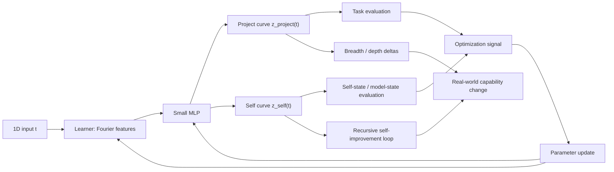

# LLC (Learned Latent Curve) Chart

```mermaid
flowchart LR
  A["1D input t"] --> B["Learner: Fourier features"]
  B --> C["Small MLP"]
  C --> D["Project curve z_project(t)"]
  C --> E["Self curve z_self(t)"]

  D --> F["Task evaluation"]
  E --> G["Self-state / model-state evaluation"]

  F --> H["Optimization signal"]
  G --> H

  H --> I["Parameter update"]
  I --> B
  I --> C

  D --> J["Breadth / depth deltas"]
  E --> K["Recursive self-improvement loop"]

  J --> L["Real-world capability change"]
  K --> L
```

  
