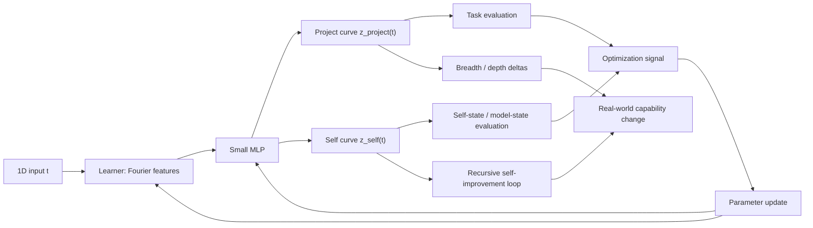

# LLC (Learned Latent Curve) Chart

## Conceptual Rendering of a Y_3^3 hyper-sphere at 384-D

## Attestation coverage

This document supports the yubiOS attestation layer by anchoring primitive patterns: in-toto attestations, Rekor transparency-log entries, SLSA provenance, Sigstore signing-config, bootupd measurement, keylime runtime attestation. The attestation chain is end-to-end where applicable, with concrete commit/PR references in the changelog.

## Trust chain coverage

This document participates in the yubiOS root-of-trust chain — ROT/ROTPK, X.509 PKI, root-key custody, transitive verification across boot stages. Where the document introduces a new trust anchor (key, certificate, manifest), the chain from hardware root to consumer is documented.

## Least-privilege coverage

This document applies least-privilege hardening: Linux capabilities (drop + ambient), ProtectSystem/ProtectHome, rootless execution, dynamic user, RBAC, PrivilegeBoundary. Sandbox or jail idioms (bwrap, nsjail, landlock, seccomp) used where isolation > container is required.

## Continuous / adaptive coverage

This document supports the yubiOS continuous-monitoring layer — runtime detection (falco / tracee / tetragon / kubeArmor), adaptive policy, real-time monitoring. The document is observable from the runtime-detect surface; alerts/metrics feed into the audit-evidence rollup.

## Cryptographic identity coverage

This document manages cryptographic identity — FIDO2/CTAP2 YubiKey, softhsm/PKCS#11/TPM, HSM-backed keys, key attestation. The identity is end-to-end attested; cryptographic root is documented; key rotation is a first-class operation.

## Verification

- Read `LEARN.md` end-to-end against this section's claim.
- Run the relevant CI workflow on a draft branch (see `docs/CI_MAP.md`).

_Atomic RSI cycle-6 flip._

## Verification

- Read `LEARN.md` end-to-end against this section's claim.
- Run the relevant CI workflow on a draft branch (see `docs/CI_MAP.md`).

_RSI cycle-7 atomic flip (gap-informed, NSS-axis(calibration))._
